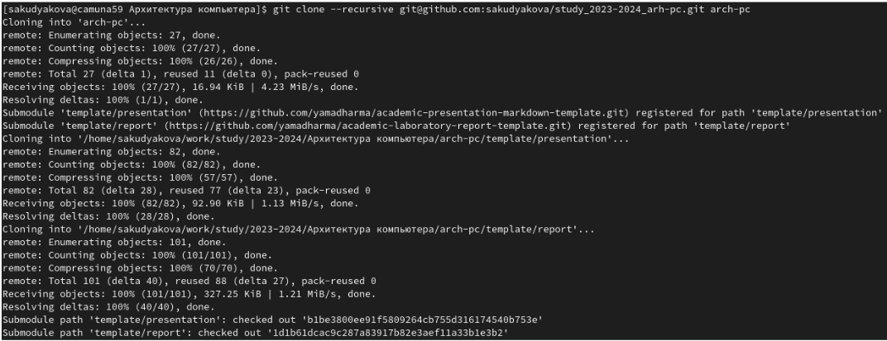
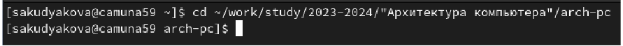

---
## Front matter
title: "Отчёт по лабораторной работе №2"
subtitle: "Дисциплина: Архитектура компьютера"
author: "София Андреевна Кудякова"

## Generic otions
lang: ru-RU
toc-title: "Содержание"

## Bibliography
bibliography: bib/cite.bib
csl: pandoc/csl/gost-r-7-0-5-2008-numeric.csl

## Pdf output format
toc: true # Table of contents
toc-depth: 2
lof: true # List of figures

fontsize: 12pt
linestretch: 1.5
papersize: a4
documentclass: scrreprt
## I18n polyglossia
polyglossia-lang:
  name: russian
  options:
	- spelling=modern
	- babelshorthands=true
polyglossia-otherlangs:
  name: english
## I18n babel
babel-lang: russian
babel-otherlangs: english
## Fonts
mainfont: PT Serif
romanfont: PT Serif
sansfont: PT Sans
monofont: PT Mono
mainfontoptions: Ligatures=TeX
romanfontoptions: Ligatures=TeX
sansfontoptions: Ligatures=TeX,Scale=MatchLowercase
monofontoptions: Scale=MatchLowercase,Scale=0.9
## Biblatex
biblatex: true
biblio-style: "gost-numeric"
biblatexoptions:
  - parentracker=true
  - backend=biber
  - hyperref=auto
  - language=auto
  - autolang=other*
  - citestyle=gost-numeric
## Pandoc-crossref LaTeX customization
figureTitle: "Рис."
tableTitle: "Таблица"
listingTitle: "Листинг"
lofTitle: "Список иллюстраций"

lolTitle: "Листинги"
## Misc options
indent: true
header-includes:
  - \usepackage{indentfirst}
  - \usepackage{float} # keep figures where there are in the text
  - \floatplacement{figure}{H} # keep figures where there are in the text
---

# Цель работы

Цель данной работы - изучить идеологию и применение средств контроля версий,
а также научиться работать с системой git.

# Задания

1. Настройка GitHub.
2. Базовая настройка Git.
3. Создание SSH-ключа.
4. Создание рабочего пространства и репозитория курса на основе шаблона.
5. Создание репозитория на основе шаблона.
6. Настройка каталога курса
7. Выполнение заданий для самостоятельной работы.

# Теоретическое введение

  Системы контроля версий (Version Control System, VCS) применяются при работе нескольких человек над одним проектом. Обычно основное дерево проекта хранится в локальном или удалённом репозитории, к которому настроен доступ для участников проекта. При внесении изменений в содержание проекта система контроля версий позволяет их фиксировать, совмещать изменения, произведённые разными участниками проекта, производить откат к любой более ранней версии проекта, если это требуется. В классических системах контроля версий используется централизованная модель, предполагающая наличие единого репозитория для хранения файлов. Выполнение большинства функций по управлению версиями осуществляется специальным сервером. Участник проекта (пользователь) перед началом работы посредством определённых команд получает нужную ему версию файлов. После внесения изменений, пользователь размещает новую версию в хранилище. При этом предыдущие версии не удаляются из центрального хранилища и к ним можно вернуться в любой момент. Сервер может сохранять не полную версию изменённых файлов, а производить так называемую дельта- компрессию - сохранять только изменения между последовательнымиверсиями, что позволяет уменьшить объём хранимых данных. Системы контроля версий поддерживают возможность отслеживания и разрешения конфликтов, которые могут возникнуть при работе нескольких человек над одним файлом. Можно объединить изменения, сделанные разными участниками (автоматически или вручную), вручную выбрать нужную версию, отменить изменения вовсе или заблокировать файлы для изменения. В зависимости от настроек блокировка не позволяет другим пользователям получить рабочую копию или препятствует изменению рабочей копии файла средствами файловой системы ОС, обеспечивая таким образом, привилегированный доступ только одному пользователю, работающему с файлом.Системы контроля версий также могут обеспечивать дополнительные, более гибкие функциональные возможности. Например, они могут поддерживать работу с несколькими версиями одного файла, сохраняя общую историю изменений до точки ветвления версий и собственные истории изменений каждой ветви. Кроме того, обычно доступна информация о том, кто из участников, когда и какие изменения вносил. Обычно такого рода информация хранится в журнале изменений, доступ к которому можно ограничить. В отличие от классических, в распределённых системах контроля версий центральный репозиторий не является обязательным. Среди классических VCS наиболее известны CVS, Subversion, а среди распределённых — Git, Bazaar, Mercurial. Принципы их работы схожи, отличаются они в основном синтаксисом используемых в работе команд. Система контроля версий Git представляет собой набор программ командной строки. Доступ к ним можно получить из терминала посредством ввода команды git с различными опциями. Благодаря тому, что Git является распределённой системой контроля версий, резервную копию локального хранилища можно сделать простым копированием или архивацией.

# Выполнение лабораторной работы
## Настройка GitHub

  Создаю учётную запись на сайте https://github.com/ и заполняю основные данные. (рис. @fig:1).

{#fig:1 width=70%}

## Базовая настройка Git

  Делаю предварительную конфигурацию git. Открываю терминал и ввожу следующие команды, указав имя и email своего репозитория. (рис. @fig:2).

{#fig:2 width=70%}

  Настраиваю utf-8 в выводе сообщений git (рис. @fig:3).

{#fig:3 width=70%}

  Задаю имя начальной ветки (будем называть её master). Далее устанавливаю параметры autocrlf и safecrlf (рис. @fig:4).

{#fig:4 width=70%}

## Создание SSH ключа

  Для последующей идентификации пользователя на сервере репозиториев необходимо сгенерировать пару ключей (приватный и открытый) (рис. @fig:5). Ключи сохранятся в каталоге ~/.ssh/

{#fig:5 width=70%}

  Устанавливаю xclip. (рис. @fig:6).
  
{#fig:6 width=70%}

  С помощью xclip копирую сгенерированный ключ. (рис. @fig:7).
  
{#fig:7 width=70%}

Далее загружаю сгенерированный открытый ключ. Захожу на GitHub под своей учётной записью и перехожу в меню, выбираю в боковом меню “SSH and GPG keys”. Копирую ключ из локальной консоли в буфер обмена. Вставляю ключ в появившееся на сайте поле и указываю для ключа имя (Title). (рис. @fig:8).

{#fig:8 width=70%}

## Создание рабочего пространства и репозитория курса на основе шаблона 

  Открываю терминал и создаю каталог для предмета «Архитектура компьютера», использовав команду mkdir с ее опцией -p, которая, в свою очередь, позволяет рекрусивно создать все директории. С помощью команды ls проверяю корректность совершенных действий. (рис. @fig:9).

{#fig:9 width=70%}

## Создание репозитория курса на основе шаблона

  Создаю репозиторий на основе шаблона через web-интерфейс GitHub.
Перехожу на страницу репозитория с шаблоном курса и выбираю “Use this template”. (рис. @fig:10).

{#fig:10 width=70%}

  В открывшемся окне задаю имя репозитория (Repository name) study_2023–2024_arh-pc и создаю репозиторий, нажав на кнопку “Create repository” (рис. @fig:11).

{#fig:11 width=70%}

  Убеждаюсь в том, что репозиторий был создан. (рис. @fig:12).

{#fig:12 width=70%}

  Далее открываю терминал и перехожу в каталог курса, используя команду cd. (рис. @fig:13).

{#fig:13 width=70%}

  Копирую ссылку на странице созданного репозитория Code -- SSH. (рис. @fig:14).
  
{#fig:14 width=70%}
  
  Клонирую созданный репозиторий. (рис. @fig:15).
  
{#fig:15 width=70%}

## Настройка каталога курса

  Перехожу в каталог курса. (рис. @fig:16).

{#fig:16 width=70%}

  С помощью команды rm удаляю лишние файлы, а именно файл “package.json”. (рис. @fig:17).

{#fig:17 width=70%}

  Создаю необходимые каталоги. (рис. @fig:18).
  
{#fig:18 width=70%}

  Отправляю файлы на сервер. (рис. @fig:19).
  
{#fig:19 width=70%}
 
  Проверяю корректность создания иерархии рабочего пространства в локальном репозитории и на странице GitHub. (рис. @fig:20).

{#fig:20 width=70%}
 
#Задания для самостоятельной работы

 1. Создание отчета по выполнению лабораторной работы в соответствующем каталоге рабочего пространства (labs>lab02>report).
 
С помощью команды cd перехожу в каталог labs/lab02/report. Далее с помощью утилиты touch создаю файл для отчета по выполнению второй лабораторной работы. (рис. @fig:21).

{#fig:21 width=70%}

  2. Копирование отчетов по выполнению предыдущих лабораторных работ в соответствующие каталоги созданного рабочего пространства.
  
  С помощью команды cd перехожу в каталог lab01/report. (рис. @fig:22).
  
{#fig:22 width=70%}

  С помощью команды ls проверяю, есть ли в подкаталоге “Downloads” файл с отчетом по первой лабораторной работы. (рис. @fig:23).
  
{#fig:23 width=70%}

 Убеждаюсь в том, что файл есть. Далее копирую отчет в каталог lab01/report с помощью cd и проверяю корректность выполненных действий с помощью ls. (рис. @fig:24).
 
{#fig:24 width=70%}

  3. Загрузка файлов на GitHub.
  
  С помощью команды git add добавляю файлы. Далее сохраняю изменения, используя команду git commit -m и добавляя пояснение “Add existing file”. После чего использую команду git push, чтобы отправить файлы в репозиторий. (рис. @fig:25).
  
{#fig:25 width=70%}

  Захожу на GitHub, чтобы проверить действительно ли загрузились файлы. (рис. @fig:26).
  
{#fig:26 width=70%}

  Такие же действия выполняю, чтобы добавить отчет по второй лабораторной работе на GitHub.
  
# Выводы

В ходе данной лабораторной работы я изучила идеологию и применение средств контроля версий, а также научилась работать с системой git.
