---
## Front matter
title: "Отчёт по лабораторной работе №3"
subtitle: "Дисциплина: Архитектура компьютера"
author: "София Андреевна Кудякова"

## Generic otions
lang: ru-RU
toc-title: "Содержание"

## Bibliography
bibliography: bib/cite.bib
csl: pandoc/csl/gost-r-7-0-5-2008-numeric.csl

## Pdf output format
toc: true # Table of contents
toc-depth: 2
lof: true # List of figures

fontsize: 12pt
linestretch: 1.5
papersize: a4
documentclass: scrreprt
## I18n polyglossia
polyglossia-lang:
  name: russian
  options:
	- spelling=modern
	- babelshorthands=true
polyglossia-otherlangs:
  name: english
## I18n babel
babel-lang: russian
babel-otherlangs: english
## Fonts
mainfont: PT Serif
romanfont: PT Serif
sansfont: PT Sans
monofont: PT Mono
mainfontoptions: Ligatures=TeX
romanfontoptions: Ligatures=TeX
sansfontoptions: Ligatures=TeX,Scale=MatchLowercase
monofontoptions: Scale=MatchLowercase,Scale=0.9
## Biblatex
biblatex: true
biblio-style: "gost-numeric"
biblatexoptions:
  - parentracker=true
  - backend=biber
  - hyperref=auto
  - language=auto
  - autolang=other*
  - citestyle=gost-numeric
## Pandoc-crossref LaTeX customization
figureTitle: "Рис."
tableTitle: "Таблица"
listingTitle: "Листинг"
lofTitle: "Список иллюстраций"

lolTitle: "Листинги"
## Misc options
indent: true
header-includes:
  - \usepackage{indentfirst}
  - \usepackage{float} # keep figures where there are in the text
  - \floatplacement{figure}{H} # keep figures where there are in the text
---

# Цель работы

Цель данной работы - научиться оформлять отчеты с помощью легковесного языка разметки Markdown. 

# Задание

	1. Установка необходимого ПО.
	2. Заполнение отчета по выполнению лабораторной работы №3 с помощью языка разметки Markdown. 
	3. Задания для самостоятельной работы.
	
# Теоретическое введение

Markdown - легковесный язык разметки, созданный с целью обозначения форматирования в простом тексте, с максимальным сохранением его читаемости человеком, и пригодный для машинного преобразования в языки для продвинутых публикаций. Внутритекстовые формулы делаются аналогично формулам LaTeX. В Markdown вставить изображение в документ можно с помощью непосредственного указания адреса изображения. Синтаксис Markdown для встроенной ссылки состоит из части [link text], представляющей текст гиперссылки, и части (file-name.md) - URL-адреса или имени файла, на который дается ссылка. Markdown поддерживает как встраивание фрагментов кода в предложение, так и их размещение между предложениями в виде отдельных огражденных блоков. Огражденные блоки кода — это простой способ выделить синтаксис для фрагментов кода. 

# Выполнение лабораторной работы

1. Установка необходимого ПО 

  Установка TexLive. Сначала необходимо скачать TextLive с официального сайта и распоковать архив. Далее необходимо перейти в распакованную папку с помощью cd. Затем необходимо запустить скрипт install-tl с правами root, используя sudo в начале команды и добавить /usr/local/texlive/2023/bin/x86_64-linux в свой PATH для текущей и будущих сессий. 
  Установка pandoc и pandoc-crossref. Нужно скачать архив pandoc и pandoc-crossref и распаковать скаченные архивы.Затем необходимо скопировать файл pandoc и pandoc-crossref в каталог /usr/local/bin/ с правами пользователя root, используя sudo.
  Я выполняю лабораторную работу в дисплейном классе, где заранее все установлено, поэтому пропускаю вышеперечисленные действия. 
  

2. Открыв терминал, перехожу в каталог курса, сформированный при выполненнии прошлой лаборатной работы. Обновляю локальный репозиторий. Перехожу в каталог с шаблоном отчета по лабораторной работе №3 с помощью cd. (рис. @fig:1).

{#fig:1 width=70%}

  Провожу компиляцию шаблона с использованием Makefile с помощью команды make. (рис. @fig:2)

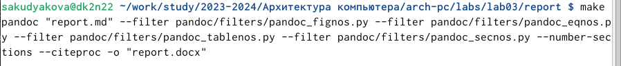{#fig:2 width=70%}

  Открываю сгенерированные файлы report.docx и report.pdf и проверяю корректность полученных файлов. Убеждаюсь, что все правильно сработало. Удаляю полученные файлы с использованием Makefile с помощью make clean. (рис. @fig:3)
  
![Файлы report.docx и report.pdf и их удаление] (image/lab03_3.png){#fig:3 width=70%} 

   Проверяю корректность выполненных действий. (рис. @fig:4).
  
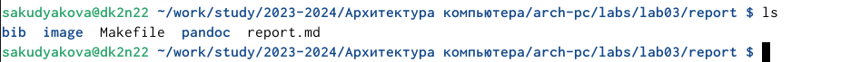{#fig:4 width=70%} 

  Открываю файл report.md с помощью gedit (рис. @fig:5).
  
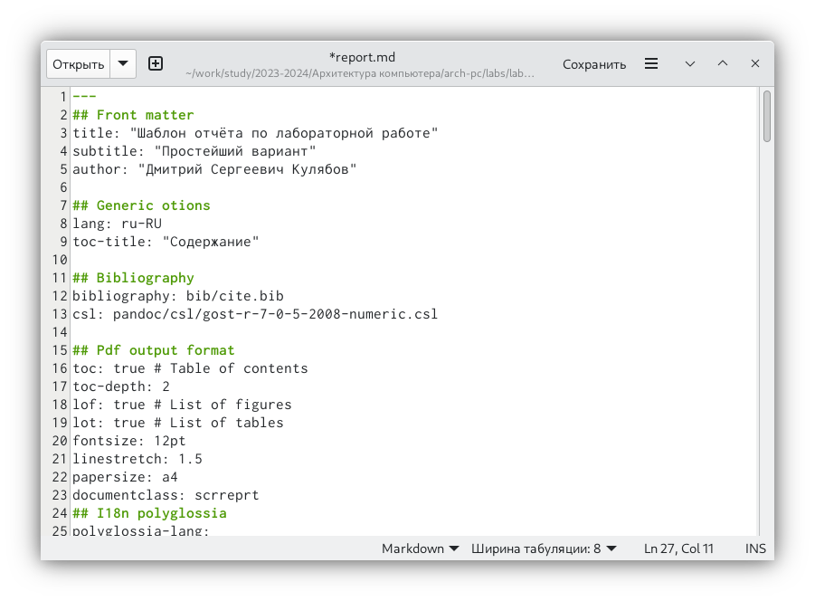{#fig:5 width=70%} 

  Копирую файл с новым названием с помощью cp (рис. @fig:6).

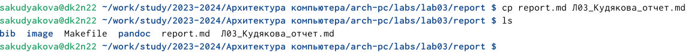{#fig:6 width=70%} 

  Открываю файл, начинаю заполнять отчёт(рис. @fig:7).
  
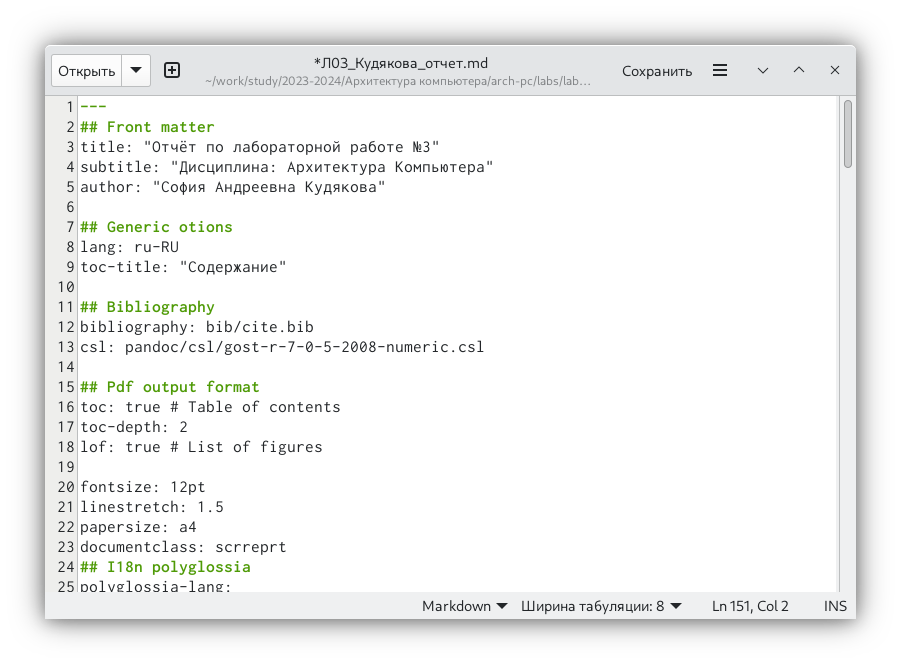{#fig:7 width=70%}

# Выполнение заданий для лабораторной работы 

  1. Перехожу в lab02/report с помощью cd, чтобы заполнять отчет по второй лабораторной работе. (рис. @fig:8).
  
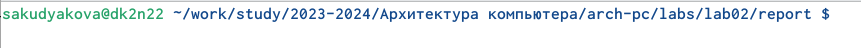{#fig:8 width=70%} 

   Копирую и переименовываю файл report.md для заполнения отчета по второй лабораторной работе. (рис. @fig:9).

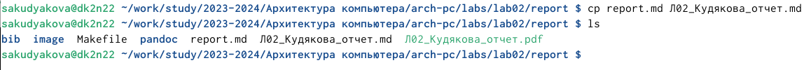{#fig:9 width=70%} 

   Открываю файл с помощью gedit и начинаю заполнять отчет.(рис. @fig:10)
   
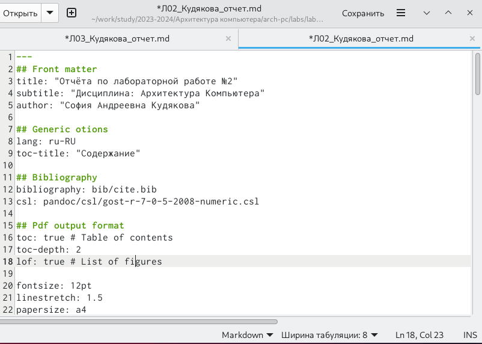{#fig:10 width=70%} 

  2. Компилирую файлы с отчетом (рис. @fig:11).
 
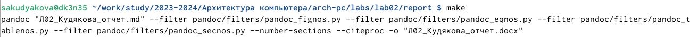{#fig:11 width=70%}

  3. Проверяю содержимое каталога и удаляю ненужные файлы report.docx, report.pdf (рис. @fig:12).
  
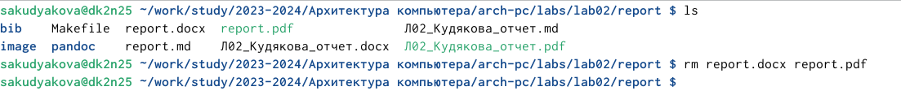{#fig:12 width=70%}
 
  4. Добавляю все на GitHub с помощью git add и сохраняю изменения с помощью git commit. (рис. @fig:13).
  
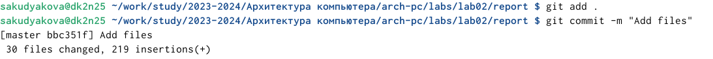{#fig:13 width=70%}

  5. Отправляю файлы на сервер с помощью команды git push(рис. @fig:14).
  
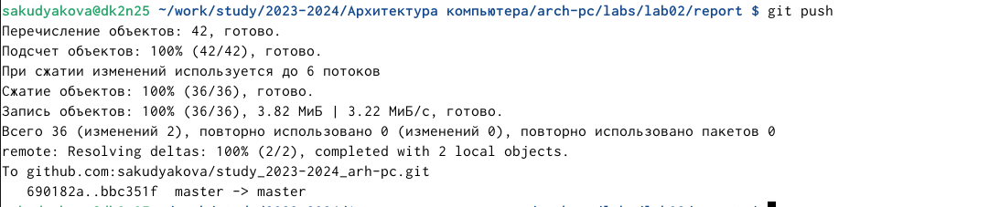{#fig:14 width=70%}

# Вывод 

    В ходе данной лабораторной работы я научилась оформлять отчеты с помощью легковесного языка разметки Markdown. 

  
# Список литературы
 
   1. Архитектура ЭВМ
