---
## Front matter
title: "Отчёт по лабораторной работе №4"
subtitle: "Дисциплина: Архитектура Компьютера"
author: "София Андреевна Кудякова"

## Generic otions
lang: ru-RU
toc-title: "Содержание"

## Bibliography
bibliography: bib/cite.bib
csl: pandoc/csl/gost-r-7-0-5-2008-numeric.csl

## Pdf output format
toc: true # Table of contents
toc-depth: 2
lof: true # List of figures

fontsize: 12pt
linestretch: 1.5
papersize: a4
documentclass: scrreprt
## I18n polyglossia
polyglossia-lang:
  name: russian
  options:
	- spelling=modern
	- babelshorthands=true
polyglossia-otherlangs:
  name: english
## I18n babel
babel-lang: russian
babel-otherlangs: english
## Fonts
mainfont: PT Serif
romanfont: PT Serif
sansfont: PT Sans
monofont: PT Mono
mainfontoptions: Ligatures=TeX
romanfontoptions: Ligatures=TeX
sansfontoptions: Ligatures=TeX,Scale=MatchLowercase
monofontoptions: Scale=MatchLowercase,Scale=0.9
## Biblatex
biblatex: true
biblio-style: "gost-numeric"
biblatexoptions:
  - parentracker=true
  - backend=biber
  - hyperref=auto
  - language=auto
  - autolang=other*
  - citestyle=gost-numeric
## Pandoc-crossref LaTeX customization
figureTitle: "Рис."
tableTitle: "Таблица"
listingTitle: "Листинг"
lofTitle: "Список иллюстраций"

lolTitle: "Листинги"
## Misc options
indent: true
header-includes:
  - \usepackage{indentfirst}
  - \usepackage{float} # keep figures where there are in the text
  - \floatplacement{figure}{H} # keep figures where there are in the text
---

# Цель работы

Цель данной работы - научиться работать с программами, написанными на ассемблере NASM, а именно - освоить процедуры компиляций и сборки программ.

# Задание

	1. Создание программы Hello World!
	2. Работа с транслятором NASM
	3. Работа с расширенным синтаксисом командной строки NASM
	4. Работа с компоновщиком LD
	5. Запуск исполняемого файла
	6. Выполнение заданий для самостоятельной работы
	
# Теоретическое введение

 Язык ассемблера (assembly language, сокращённо asm) — машинно-ориентированный язык низкого уровня. Можно считать, что он больше любых других языков приближен к архитектуре ЭВМ и её аппаратным возможностям, что позволяет получить к ним более полный доступ, нежели в языках высокого уровня,таких как C/C++, Perl, Python и пр. Но получить полный доступ к ресурсам компьютера в современных архитектурах нельзя, самым низким уровнем работы прикладной программы является обращение напрямую к ядру операционной системы. Именно на этом уровне и работают программы, написанные на ассемблере. Но в отличие от языков высокого уровня ассемблерная программа содержит только тот код, который ввёл программист. Таким образом язык ассемблера — это язык, с помощью которого понятным для человека образом пишутся команды для процессора.
 Следует отметить, что процессор понимает не команды ассемблера, а последовательности из нулей и единиц — машинные коды. До появления языков ассемблера программистам приходилось писать программы, используя только лишь машинные коды, которые были крайне сложны для запоминания, так как представляли собой числа, записанные в двоичной или шестнадцатеричной системе счисления. Преобразование или трансляция команд с языка ассемблера в исполняемый машинный код осуществляется специальной программой транслятором
 Программы, написанные на языке ассемблера, не уступают в качестве и скорости программам, написанным на машинном языке, ибо транслятор просто переводит мнемоническиеиобозначения команд в последовательности бит (нулей и единиц). Используемые мнемоники обычно одинаковы для всех процессоров одной архитектуры или семейства архитектур (среди широко известных — мнемоники процессоров и контроллеров x86, ARM, SPARC, PowerPC,M68k). Таким образом для каждой архитектуры существует свой ассемблер и, соответственно, свой язык ассемблера.
 Наиболее распространёнными ассемблерами для архитектуры x86 являются:
1) Для DOS/Windows: Borland Turbo Assembler (TASM), Microsoft Macro Assembler (MASM) и Watcom assembler (WASM).
2) Для GNU/Linux: gas (GNU Assembler), использующий AT&T-синтаксис, в отличие отбольшинства других популярных ассемблеров, которые используют Intel-синтаксис.
 Для записи команд в NASM используются:
1) Мнемокод— непосредственно мнемоника инструкции процессору, которая является обязательной частью команды. 
2) Операнды - числа, данные, адреса регистров или адреса оперативной памяти. 
3) Метка — идентификатор, с которым ассемблер ассоциирует некоторое число, чаще всего адрес в памяти. (Метка перед командой связана с адресом данной команды). Допустимыми символами в метках являются буквы, цифры, а также следующие символы:
 _, $, #, @,~,. и ?.
 Начинаться метка или идентификатор могут с буквы, ., _ и ?.
 Перед идентификаторами, которые пишутся как зарезервированные слова, нужно писать $, чтобы компилятор трактовал его верно (так называемое экранирование). Максимальная длина идентификатора составляет 4095 символов.
 Программа на языке ассемблера также может содержать директивы — инструкции, не переводящиеся непосредственно в машинные команды, а управляющие работой транслятора. Например, директивы используются для определения данных (констант и переменных) и обычно пишутся большими буквами.

# Выполнение лабораторной работы
 
1. Программа Hello World!

 Используя комаанду cd перемещаюсь в lab05. (рис. @fig:1).

{#fig:1 width=70%}

 Используя утилиту touch, создаю пустой текстовый файл hello.asm и проверяю корректность выполненных действий с помощью ls.  (рис. @fig:2). 
 
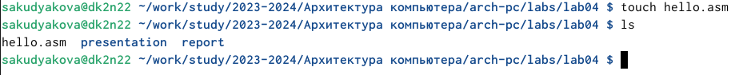{#fig:2 width=70%}
 
 Далее созданный файл открываю в текстовом редакторе gedit. (рис. @fig:3).

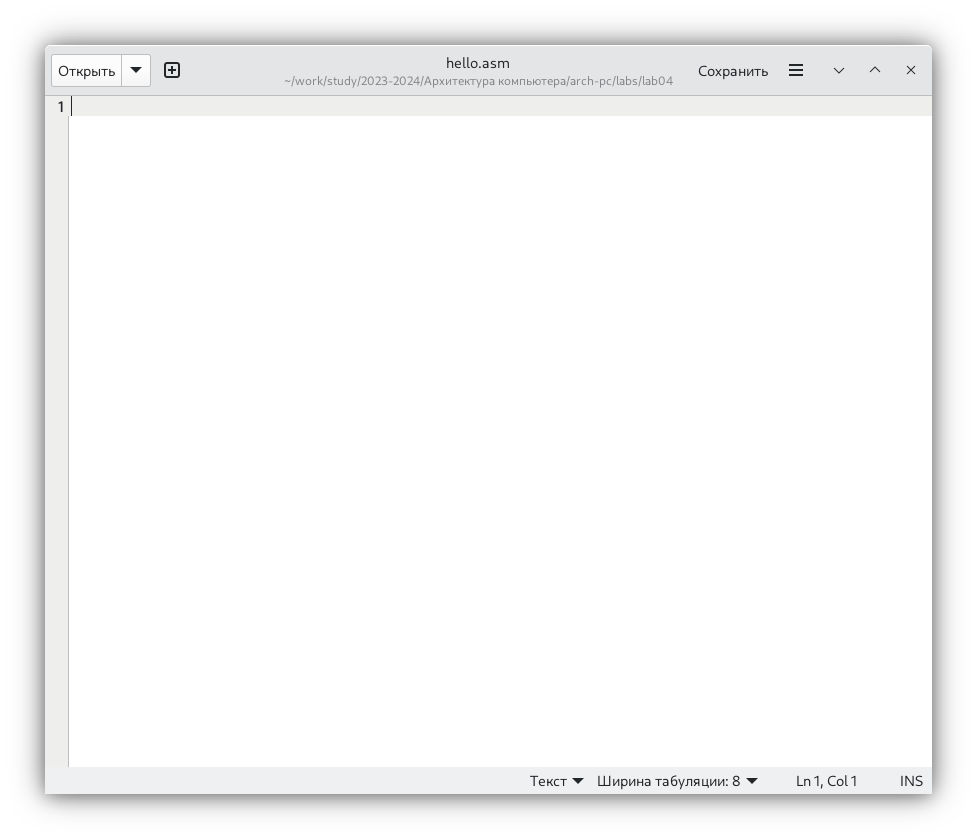{#fig:3 width=70%}

 Заполняю файл текстом, нужным для вывода "Hello World!". (рис. @fig:4).
 
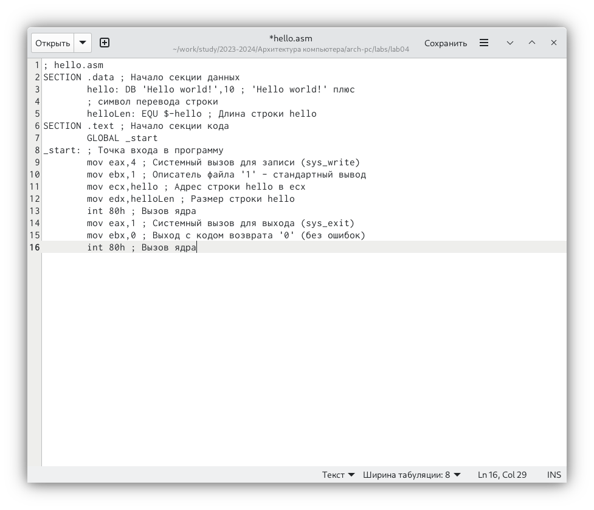{#fig:4 width=70%}

2. Работа с транслятором NASM
 
 NASM превращает текст программы в объектный код. Для приведённого выше текста программы "Hello World" выполнил компиляцию, используя команду nasm -f elf hello.asm ,ключ -f указывает транслятору nasm, что необходимо создать бинарный файл в формате ELF. Затем проверяю корректность выполненных действий с помощью ls. (рис. @fig:5).

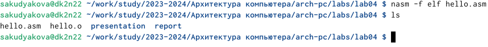{#fig:5 width=70%}

 После проверки убеждаюсь, что был создан файл "hello.o"
 
3. Работа с расширенным синтаксисом командной строки NASM
 
 Ввожу команду, которая скомпилирует файл hello.asm в файл obj.o, опция -o позволяет
задать имя объектного файла, в данном случае obj.o, при этом формат выходного файла
будет elf и в файл будут включены символы для отладки (ключ -g), также с помощью ключа -l будет создан файл листинга list.lst. Проверяю правильность выполнения команды с помощью команды ls. (рис. @fig:6).
 
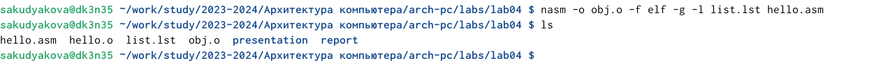{#fig:6 width=70%}

4. Работа с компоновщиком LD

 Передаю объектный файл hello.o на обработку компоновщику LD, чтобы получить исполняемый файл hello. Ключ -о задает имя создаваемого исполняемого файла. С помощью команды ls убеждаюсь, что исполняемый файл hello был создан.(рис. @fig:7).

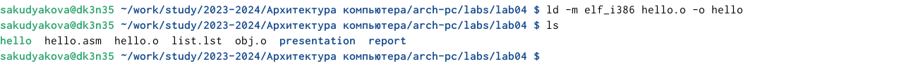{#fig:7 width=70%}

 Выполняю следующуюю команду:  d -m elf_i386 obj.o -o main. Так как я использовала ключ -о, которое задало значение main, исполняемый файл будет иметь имя main. Объектный файл, из которого собран этот исполняемый файл, имеет имя obj.o (рис. @fig:8)

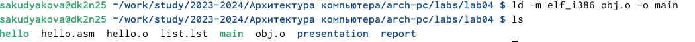{#fig:8 width=70%}

5. Запуск исполняемого файла
 
 Запускаю на выполнение созданный исполняемый файл hello, находящийся в текущем каталоге. (рис. @fig:9).

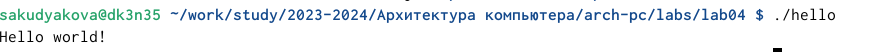{#fig:9 width=70%}

6. Выполнение заданий для самостоятельной работы
 
 С помощью команды cp создаю в текущем каталоге копию файла hello.asm с именем lab4.asm.(рис. @fig:10).
 
{#fig:10 width=70%}

 С помощью текстового редактора gedit открываю файл lab4.asm и вношу изменения в программу так, чтобы она выводила мое имя и фамилию. (рис. @fig:11)

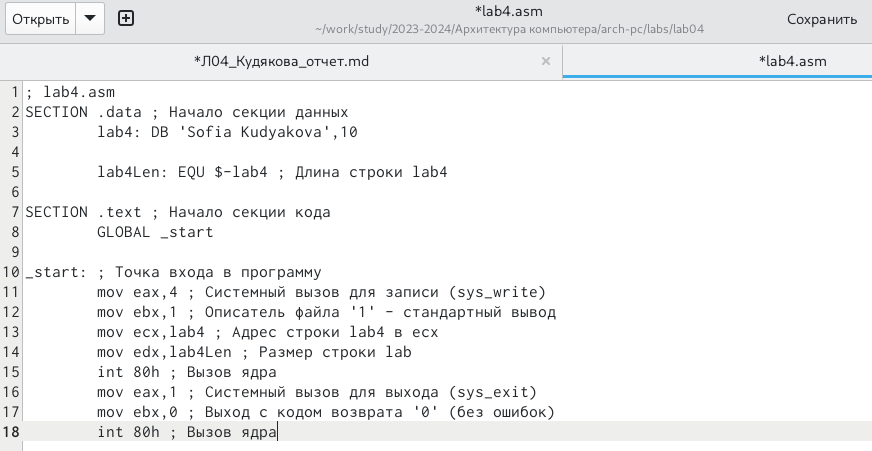{#fig:11 width=70%}
 
 Компилирую текст программы в объектный файл. (рис. @fig:12)
 
{#fig:12 width=70%}

 Передаю файл lab4.asm, на обработку компоновщику LD, чтобы получить исполняемый файл.(рис. @fig:13)
 
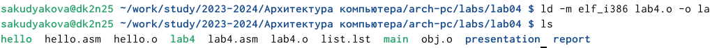{#fig:13 width=70%}

 Запускаю исполняемый файл lab4.asm. Программа сработала корректно, на экран действительно выводятся мои имя и фамилия.(рис. @fig:14)
 
{#fig:14 width=70%}
 
 Добавляю файлы в GitHub, используя команду git add . и git commit, комментируя свое действие как New files for lab 4. (рис. @fig:15)
 
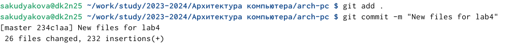{#fig:15 width=70%}

 Отправляю файлы на сервер с помощью команды git push.(рис. @fig:16)
 
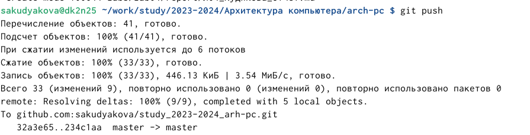{#fig:16 width=70%}

# Выводы

В ходе данной лабораторной работы я научилась работать с программами, написанными на ассемблере NASM, а именно - смогла освоить процедуры компиляций и сборки программ.

# Список литературы{.unnumbered}

 [Архитектура ЭВМ](https://esystem.rudn.ru/pluginfile.php/2089084/mod_resource/content/0/Лабораторная%20работа%20№4.%20Создание%20и%20процесс%20обработки%20программ%20на%20языке%20ассемблера%20NASM.pdf)

