---
## Front matter
title: "Отчёт по лабораторной работе №5"
subtitle: "Дисциплина: Архитектура компьютера"
author: "София Андреевна Кудякова"

## Generic otions
lang: ru-RU
toc-title: "Содержание"

## Bibliography
bibliography: bib/cite.bib
csl: pandoc/csl/gost-r-7-0-5-2008-numeric.csl

## Pdf output format
toc: true # Table of contents
toc-depth: 2
lof: true # List of figures

fontsize: 12pt
linestretch: 1.5
papersize: a4
documentclass: scrreprt
## I18n polyglossia
polyglossia-lang:
  name: russian
  options:
	- spelling=modern
	- babelshorthands=true
polyglossia-otherlangs:
  name: english
## I18n babel
babel-lang: russian
babel-otherlangs: english
## Fonts
mainfont: PT Serif
romanfont: PT Serif
sansfont: PT Sans
monofont: PT Mono
mainfontoptions: Ligatures=TeX
romanfontoptions: Ligatures=TeX
sansfontoptions: Ligatures=TeX,Scale=MatchLowercase
monofontoptions: Scale=MatchLowercase,Scale=0.9
## Biblatex
biblatex: true
biblio-style: "gost-numeric"
biblatexoptions:
  - parentracker=true
  - backend=biber
  - hyperref=auto
  - language=auto
  - autolang=other*
  - citestyle=gost-numeric
## Pandoc-crossref LaTeX customization
figureTitle: "Рис."
tableTitle: "Таблица"
listingTitle: "Листинг"
lofTitle: "Список иллюстраций"

lolTitle: "Листинги"
## Misc options
indent: true
header-includes:
  - \usepackage{indentfirst}
  - \usepackage{float} # keep figures where there are in the text
  - \floatplacement{figure}{H} # keep figures where there are in the text
---

# Цель работы

 Цель данной лабораторной работы - научиться работать с Midnight Commander, а также освоить инструкции языка ассамблера mov и int.

# Задания

1. Основы работы с mc
2. Структура программы на языке ассамблера NASM
3. Подключение внешнего файла
4. Выполнение заданий для самостоятельной работы

# Теоретическое введение

  Midnight Commander (или просто mc) — это программа, которая позволяет просматривать структуру каталогов и выполнять основные операции по управлению файловой системой, т.е. mc является файловым менеджером. Midnight Commander позволяет сделать работу с файлами более удобной и наглядной.Программа на языке ассемблера NASM, как правило, состоит из трёх секций: секция кода программы (SECTION .text), секция инициированных (известных во время компиляции) данных (SECTION .data) и секция неинициализированных данных (тех, под которые во время компиляции только отводится память, а значение присваивается в ходе выполнения программы) (SECTION .bss). Для объявления инициированных данных в секции .data используются директивы DB, DW, DD, DQ и DT, которые резервируют память и указывают, какие значения должны храниться в этой памяти: DB (define byte) — определяет переменную размером в 1 байт; DW (define word) — определяет переменную размеров в 2 байта (слово); DD (define double word) — определяет переменную размером в 4 байта (двойное слово); DQ (define quad word) — определяет переменную размером в 8 байт (учетверённое слово); DT (define ten bytes) — определяет переменную размером в 10 байт. Директивы используются для объявления простых переменных и для объявления массивов. Для определения строк принято использовать директиву DB в связи с особенностями хранения данных в оперативной памяти. Синтаксис директив определения данных следующий: <имя> DB <операнд> [, <операнд>] [, <операнд>]. Для объявления неинициированных данных в секции .bss используются директивы resb, resw, resd и другие, которые сообщают ассемблеру, что необходимо зарезервировать заданное количество ячеек памяти. Инструкция языка ассемблера mov предназначена для дублирования данных источника в приёмнике. В общем виде эта инструкция записывается в виде

```NASM
mov dst,src
```

Здесь операнд dst — приёмник, а src — источник. В качестве операнда могут выступать регистры (register), ячейки памяти (memory) и непосредственные значения (const). Инструкция языка ассемблера intпредназначена для вызова прерывания с указанным номером. В общем виде она записывается в виде

```NASM
int n
```

Здесь n — номер прерывания, принадлежащий диапазону 0–255. При программировании в Linux с использованием вызовов ядра sys_calls n=80h (принято задавать в шестнадцатеричной системе счисления).

# Выполнение лабораторной работы
## Основы работы с mc

 Ввожу команду mc, с помощью которой открывается Midnight Commander. (рис. @fig:1).

{#fig:1 width=70%}

 Убеждаюсь, что команда сработала, так как открылся mc. (рис. @fig:2).
 
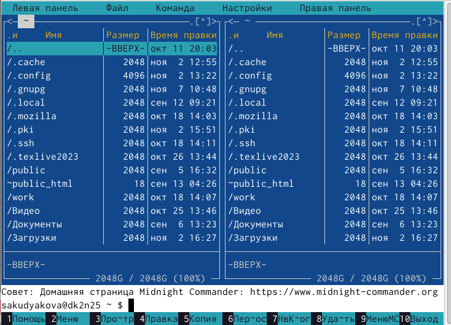{#fig:2 width=70%}

  Перехожу в каталог ~/work/arch-pc и с помощью функциональной клавиши F7 создаю папку lab05 и перехожу в созданный каталог. (рис. @fig:3).

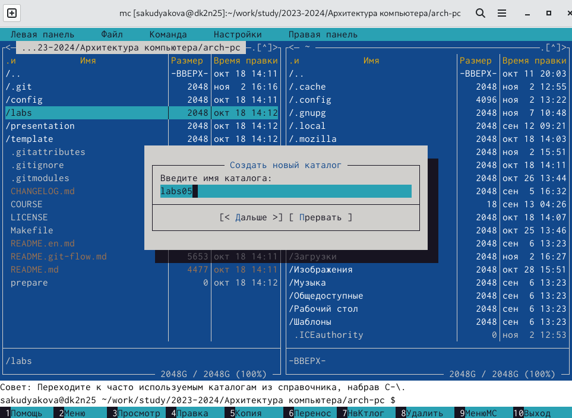{#fig:3 width=70%}

   Пользуясь строкой ввода и командой touch создаю файл lab5-1.asm. (рис. @fig:4).

{#fig:4 width=70%}

## Структура программы на языке ассамблера NASM

  С помощью клавиши F4 открываю созданный файл в редакторе nano. (рис. @fig:5). 

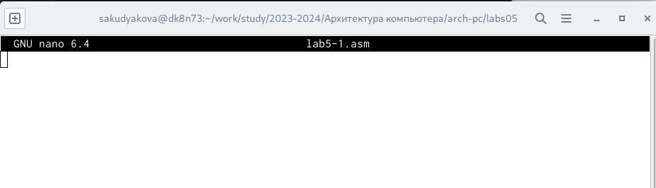{#fig:5 width=70%}

  Ввожу код программы для запроса строки у пользователя в файл. Затем выхожу из файла, сохранив все изменения. (рис. @fig:6).
  
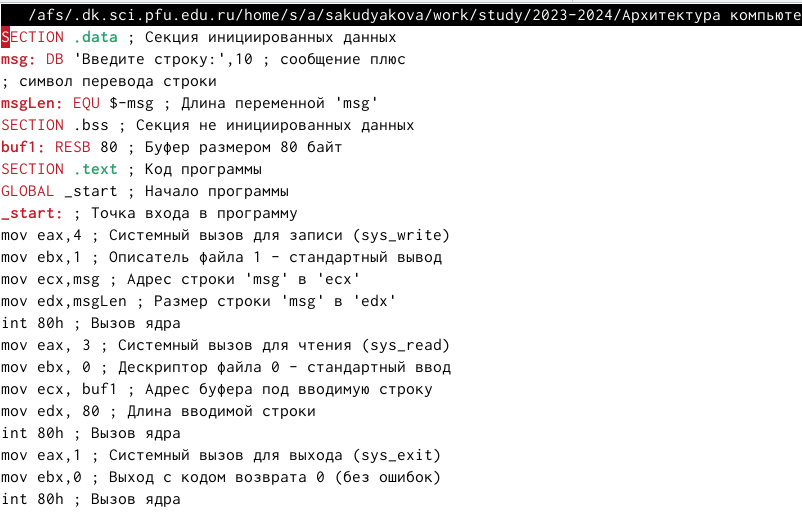{#fig:6 width=70%}

  С помощью клавиши F3 открываю файл для просмотра и убеждаюсь, что внесенный код программы был сохранен. (рис. @fig:7).
  
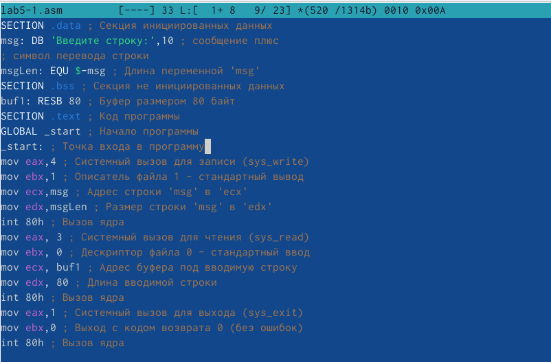{#fig:7 width=70%}

  Транслируйте текст программы lab5-1.asm в объектный файл. Выполняю компоновку объектного файла и запускаю получившийся исполняемый файл. Программа выводит строку 'Введите строку:' и ожидает ввода с клавиатуры. На запрос введите свои ФИО.(рис. @fig:8).

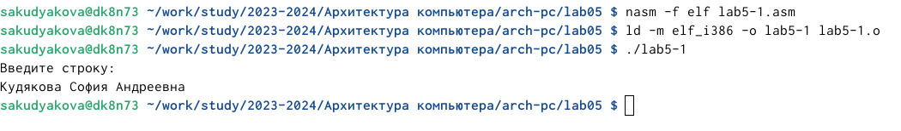{#fig:8 width=70%}

## Подключение внешнего файла
  
  Скачиваю файл in_out.asm со страницы курса в ТУИС. Он сохранился в каталог "Загрузки". (рис. @fig:9).

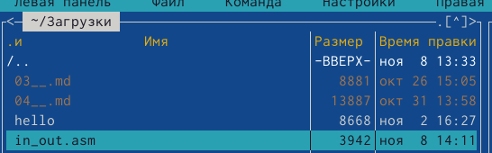{#fig:9 width=70%}

   Копирую файл in_out.asm из каталога "Загрузки" в каталог lab05 с помощью функциональной клавиши F5. (рис. @fig:10).

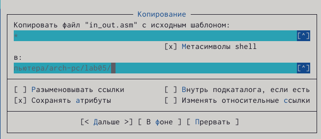{#fig:10 width=70%}

  С помощью функциональной клавиши F6 создаю копию файла lab5-1.asm с именем lab5-2.asm. Выделяю файл lab5-1.asm, нажимаю клавишу F6, ввожу имя файла lab5-2.asm и нажимю Enter. (рис. @fig:11).

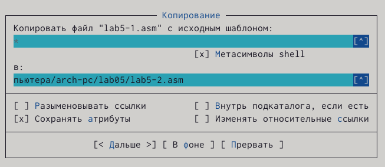{#fig:11 width=70%}

  Исправляю текст программы в файле lab5-2.asm с использованием подпрограмм из внешнего файла in_out.asm.  (рис. @fig:12).

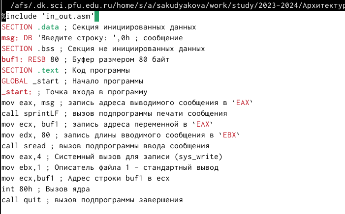{#fig:12 width=70%}

  Транслируйте текст программы lab5-2.asm в объектный файл. Выполняю компоновку объектного файла и запускаю получившийся исполняемый файл. Программа выводит строку 'Введите строку:' и ожидает ввода с клавиатуры.  (рис. @fig:13).

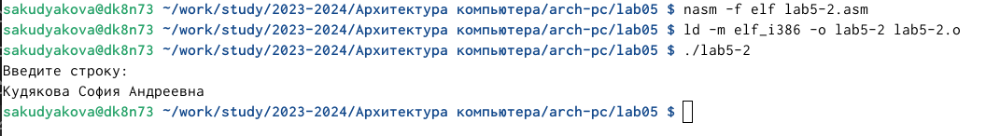{#fig:13 width=70%}

  В файле lab5-2.asm меняю подпрограмму sprintLF на sprin. (рис. @fig:14).
  
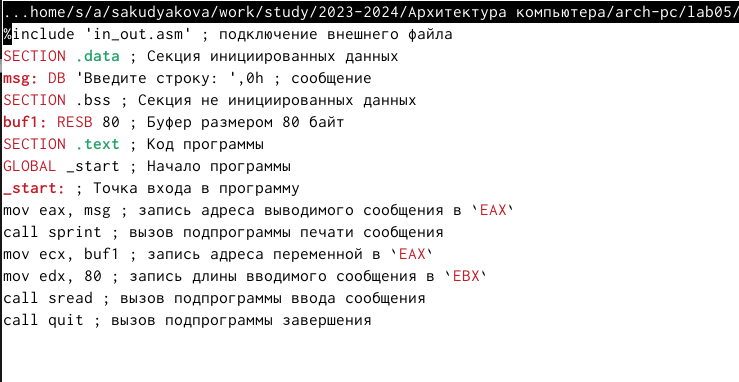{#fig:14 width=70%}
  
  Затем транслирую файл, выполняю компоновку объектного файла и заупскаю новый исполняемый файл. (рис. @fig:15).
  
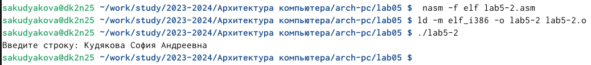{#fig:15 width=70%}
 
  Разница между подпрограммами sprintLF и sprint заключается в том, что в первом случае(sprintLF) ввод запрашивается с новой строки, а во втором случае(sprint) - с той же.

## Выполнение заданий для самостоятельной работы

1. Копирую файл lab5-1.asm и создаю нвый с именем lab5-1-1.asm. (рис. @fig:16).

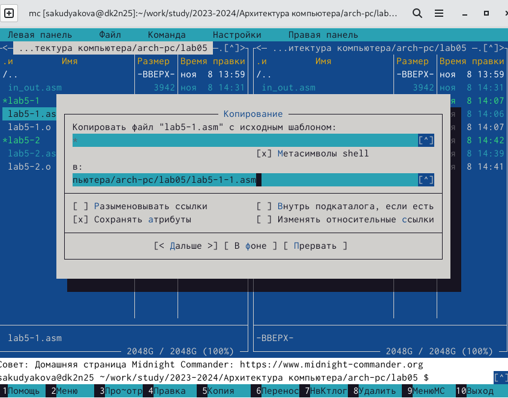{#fig:16 width=70%}

  Открываю файл с помощью F4 для редактирования. Изменяю программу так, чтобы она выводила вывод приглашения, запрос ввода и вводимую пользователем строку. (рис. @fig:17).

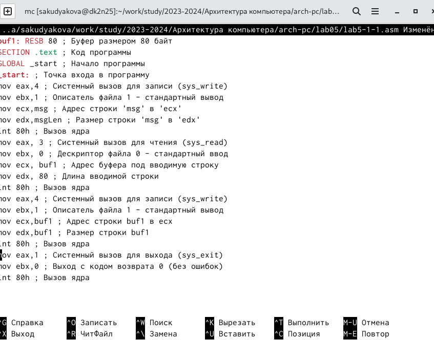{#fig:17 width=70%}

2. Создаю объектный файл lab5-1-1.o, отдаю его на обработку компоновщику, получаю исполняемый файл lab5-1-1, запускаю полученный исполняемый файл. Программа запрашивает ввод, ввожу свои ФИО, далее программа выводит введенные мною данные. (рис. @fig:18).
  
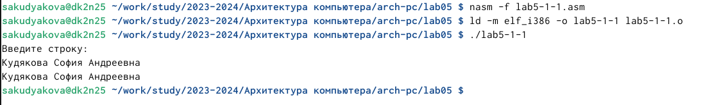{#fig:18 width=70%}

  Код программы из п.1:
  
```NASM
SECTION .text ; Код программы
GLOBAL _start ; Начало программы
_start: ; Точка входа в программу
mov eax,4 ; Системный вызов для записи (sys_write)
mov ebx,1 ; Описатель файла 1 - стандартный вывод
mov ecx,msg ; Адрес строки 'msg' в 'ecx'
mov edx,msgLen ; Размер строки 'msg' в 'edx'
int 80h ; Вызов ядра
mov eax, 3 ; Системный вызов для чтения (sys_read)
mov ebx, 0 ; Дескриптор файла 0 - стандартный ввод
mov ecx, buf1 ; Адрес буфера под вводимую строку
mov edx, 80 ; Длина вводимой строки
int 80h ; Вызов ядра
mov eax,4 ; Системный вызов для записи (sys_write)
mov ebx,1 ; Описатель файла 1 - стандартный вывод
mov ecx,buf1 ; Адрес строки buf1 в ecx
mov edx,buf1 ; Размер строки buf1
int 80h ; Вызов ядра
mov eax,1 ; Системный вызов для выхода (sys_exit)
mov ebx,0 ; Выход с кодом возврата 0 (без ошибок)
int 80h ; Вызов ядра 
```

 
3. Копирую файл lab5-2.asm и создаю нвый с именем lab5-2-1.asm. (рис. @fig:19).

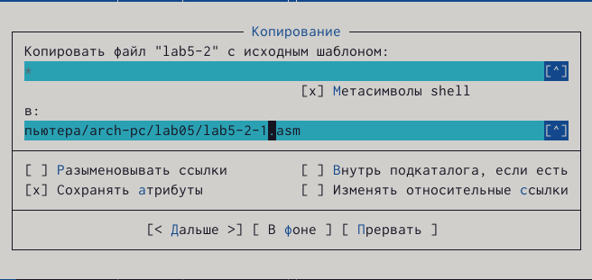{#fig:19 width=70%}

  Открываю файл с помощью F4 для редактирования. Изменяю программу так, чтобы она выводила вывод приглашения, запрос ввода и вводимую пользователем строку. (рис. @fig:20).

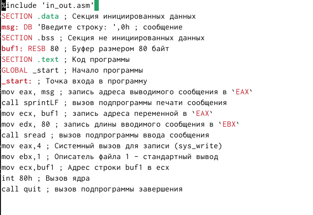{#fig:20 width=70%}

4. Создаю объектный файл lab5-2-1.o, отдаю его на обработку компоновщику, получаю исполняемый файл lab5-2-1, запускаю полученный исполняемый файл. Программа запрашивает ввод, ввожу свои ФИО, далее программа выводит введенные мною данные. (рис. @fig:21).

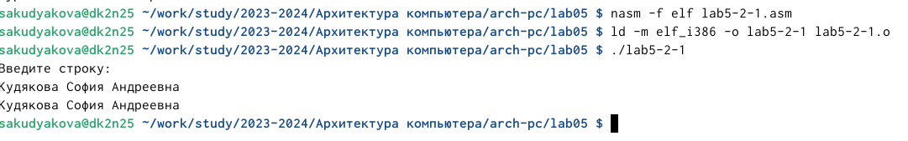{#fig:21 width=70%}


 Код программы из п.3:

```NASM
%include 'in_out.asm' 
SECTION .data ; Секция инициированных данных
msg: DB 'Введите строку: ',0h ; сообщение
SECTION .bss ; Секция не инициированных данных
buf1: RESB 80 ; Буфер размером 80 байт
SECTION .text ; Код программы
GLOBAL _start ; Начало программы
_start: ; Точка входа в программу
mov eax, msg ; запись адреса выводимого сообщения в `EAX`
call sprintLF ; вызов подпрограммы печати сообщения
mov ecx, buf1 ; запись адреса переменной в `EAX`
mov edx, 80 ; запись длины вводимого сообщения в `EBX`
call sread ; вызов подпрограммы ввода сообщения
mov eax,4 ; Системный вызов для записи (sys_write)
mov ebx,1 ; Описатель файла 1 - стандартный вывод
mov ecx,buf1 ; Адрес строки buf1 в ecx
int 80h ; Вызов ядра
call quit ; вызов подпрограммы завершения
```

 

  
# Выводы

 В ходе данной лабораторной работы я научилась работать с Midnight Commander, а также освоила инструкции языка ассамблера mov и int.
 
# Список литературы{.unnumbered}

 [Архитектура ЭВМ](https://esystem.rudn.ru/pluginfile.php/2089085/mod_resource/content/0/%D0%9B%D0%B0%D0%B1%D0%BE%D1%80%D0%B0%D1%82%D0%BE%D1%80%D0%BD%D0%B0%D1%8F%20%D1%80%D0%B0%D0%B1%D0%BE%D1%82%D0%B0%20%E2%84%965.%20%D0%9E%D1%81%D0%BD%D0%BE%D0%B2%D1%8B%20%D1%80%D0%B0%D0%B1%D0%BE%D1%82%D1%8B%20%D1%81%20Midnight%20Commander%20%28%29.%20%D0%A1%D1%82%D1%80%D1%83%D0%BA%D1%82%D1%83%D1%80%D0%B0%20%D0%BF%D1%80%D0%BE%D0%B3%D1%80%D0%B0%D0%BC%D0%BC%D1%8B%20%D0%BD%D0%B0%20%D1%8F%D0%B7%D1%8B%D0%BA%D0%B5%20%D0%B0%D1%81%D1%81%D0%B5%D0%BC%D0%B1%D0%BB%D0%B5%D1%80%D0%B0%20NASM.%20%D0%A1%D0%B8%D1%81%D1%82%D0%B5%D0%BC%D0%BD%D1%8B%D0%B5%20%D0%B2%D1%8B%D0%B7%D0%BE%D0%B2%D1%8B%20%D0%B2%20%D0%9E%D0%A1%20GNU%20Linux.pdf)
