---
## Front matter
title: "Отчёт по лабораторной работе №6"
subtitle: "Дисциплина: Архитектура компьютера"
author: "София Андреевна Кудякова"

## Generic otions
lang: ru-RU
toc-title: "Содержание"

## Bibliography
bibliography: bib/cite.bib
csl: pandoc/csl/gost-r-7-0-5-2008-numeric.csl

## Pdf output format
toc: true # Table of contents
toc-depth: 2
lof: true # List of figures

fontsize: 12pt
linestretch: 1.5
papersize: a4
documentclass: scrreprt
## I18n polyglossia
polyglossia-lang:
  name: russian
  options:
	- spelling=modern
	- babelshorthands=true
polyglossia-otherlangs:
  name: english
## I18n babel
babel-lang: russian
babel-otherlangs: english
## Fonts
mainfont: PT Serif
romanfont: PT Serif
sansfont: PT Sans
monofont: PT Mono
mainfontoptions: Ligatures=TeX
romanfontoptions: Ligatures=TeX
sansfontoptions: Ligatures=TeX,Scale=MatchLowercase
monofontoptions: Scale=MatchLowercase,Scale=0.9
## Biblatex
biblatex: true
biblio-style: "gost-numeric"
biblatexoptions:
  - parentracker=true
  - backend=biber
  - hyperref=auto
  - language=auto
  - autolang=other*
  - citestyle=gost-numeric
## Pandoc-crossref LaTeX customization
figureTitle: "Рис."
tableTitle: "Таблица"
listingTitle: "Листинг"
lofTitle: "Список иллюстраций"

lolTitle: "Листинги"
## Misc options
indent: true
header-includes:
  - \usepackage{indentfirst}
  - \usepackage{float} # keep figures where there are in the text
  - \floatplacement{figure}{H} # keep figures where there are in the text
---

# Цель работы

 Цель данной лабораторной работы - научиться пользоваться арифметическими инструкциями языка ассемблера NASM.

# Задания

1. Символьные и численные данные в NASM
2. Выполнение арифметических операций в NASM
3. Выполнение заданий для самостоятельной работы


# Теоретическое введение

  Большинство инструкций на языке ассемблера требуют обработки операндов. Адрес операнда предоставляет место, где хранятся данные, подлежащие обработке. Это могут быть данные хранящиеся в регистре или в ячейке памяти. Регистровая адресация – операнды хранятся в регистрах и в команде используются имена этих регистров, например: mov ax,bx. Непосредственная адресация – значение операнда задается непосредственно в команде, Например: mov ax,2. Адресация памяти – операнд задает адрес в памяти. В команде указывается символическое обозначение ячейки памяти, над содержимым которой требуется выполнить операцию. Ввод информации с клавиатуры и вывод её на экран осуществляется в символьном виде. Кодирование этой информации производится согласно кодовой таблице символов ASCII. ASCII – сокращение от American Standard Code for Information Interchange (Американский стандартный код для обмена информацией). Согласно стандарту ASCII каждый символ кодируется одним байтом. Среди инструкций NASM нет такой, которая выводит числа (не в символьном виде). Поэтому, например, чтобы вывести число, надо предварительно преобразовать его цифры в ASCII-коды этих цифр и выводить на экран эти коды, а не само число. Если же выводить число на экран непосредственно, то экран воспримет его не как число, а как последовательность ASCII-символов – каждый байт числа будет воспринят как один ASCII-символ – и выведет на экран эти символы. Аналогичная ситуация происходит и при вводе данных с клавиатуры. Введенные данные будут представлять собой символы, что сделает невозможным получение корректного

# Выполнение лабораторной работы
## Символьные и численные данные в NASM

 Ввожу команду mkdir, с помощью которой создаю директорию, в которой буду создавать файлы . (рис. @fig:1).

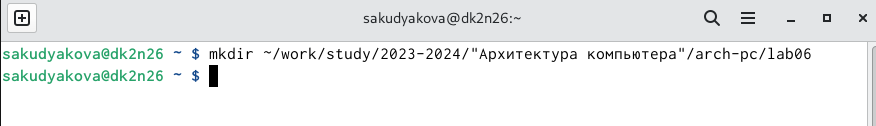{#fig:1 width=70%}

 С помощью команды touch создаю файл lab6-1.asm. (рис. @fig:2).
 
{#fig:2 width=70%}

 С помощью cp копирую файл in_out.asm в текущий каталог. (рис. @fig:3).

{#fig:3 width=70%}

 Проверяю, корректность выполненных действий с помощью команды ls. (рис. @fig:4).

{#fig:4 width=70%}

 Открываю созданный файл в редакторе и вставляю в него программу вывода значения регистра eax. (рис. @fig:5). 

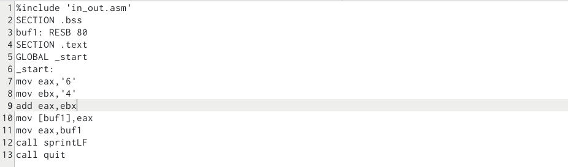{#fig:5 width=70%}

 Создаю исполняемый файл и запускаю его. Вывод программы: символ j, потому что программа вывела символ, соответствующий по системе ASCII сумме двоичных кодов символов 4 и 6.(рис. @fig:6).
  
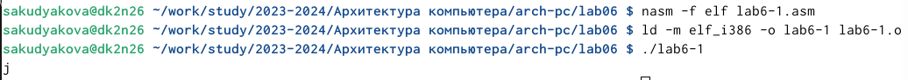{#fig:6 width=70%}

 Далее изменяю текст программы и вместо символов, записываю в регистры цифры 6 и 4. (рис. @fig:7).
  
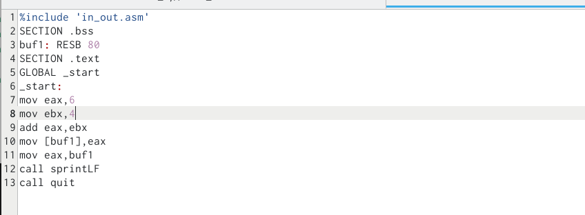{#fig:7 width=70%}

 Создаю исполняемый файл и запускаю его. В данном случае выводится символ с кодом 10. Это символ перевода строки, этот символ не отображается при выводе на экран. (рис. @fig:8).

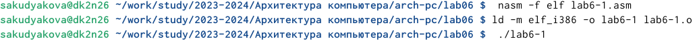{#fig:8 width=70%}
  
 Создаю новый файл lab6-2.asm в каталоге ~/work/arch-pc/lab06. (рис. @fig:9).

{#fig:9 width=70%}

 Ввожу в файл текст другой программы для вывода значения регистра eax. (рис. @fig:10).

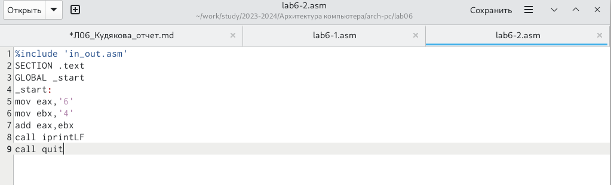{#fig:10 width=70%}

 Создаю исполняемый файл и запускаю его. В результате работы программы получается число 106, потому что программа позволяет вывести именно число, а не символ, хотя все еще происходит именно сложение кодов символов “6” и “4”. (рис. @fig:11).

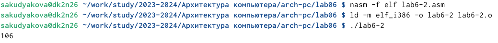{#fig:11 width=70%}

 Заменяю в тексте программы в файле lab6-2.asm символы “6” и “4” на числа 6 и 4.  (рис. @fig:12).

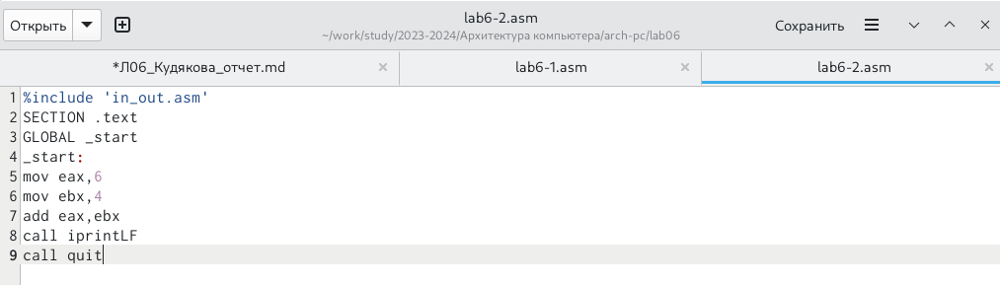{#fig:12 width=70%}

 Создаю исполняемый файл и запускаю его. Теперь программа складывает не соответствующие символам коды в системе ASCII, а сами числа, поэтому вывод 10.(рис. @fig:13).

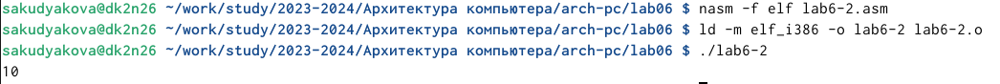{#fig:13 width=70%}

 Далее заменяю функцию iprintLF на iprint . (рис. @fig:14).
  
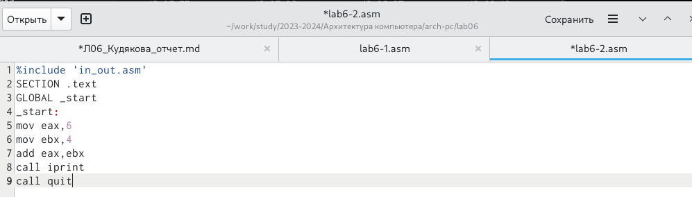{#fig:14 width=70%}
  
 Создаю исполняемый файл и запускаю его. В результате работы программы можно сделать вывод: вывод функций iprintLF и iprint различается тем, что iprint не добавляет к выводу символ переноса строки, в отличие от iprintLF. (рис. @fig:15).
  
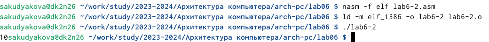{#fig:15 width=70%}

## Выполнение арифметических действий в NASM

 С помощью touch создаю файл lab6-3.asm. (рис. @fig:16).

{#fig:16 width=70%}

 Ввожу в созданный файл текст программы для вычисления значения выражения f(x) = (5 * 2 + 3)/3 (рис. @fig:17).

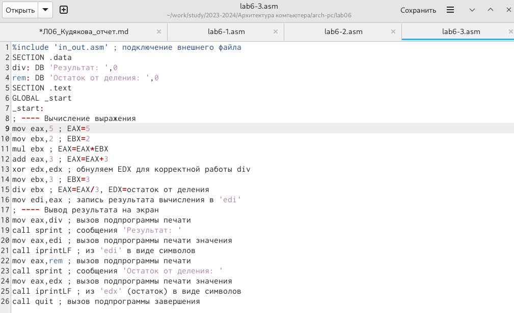{#fig:17 width=70%}

 Создаю исполняемый файл и запускаю его. (рис. @fig:18).
  
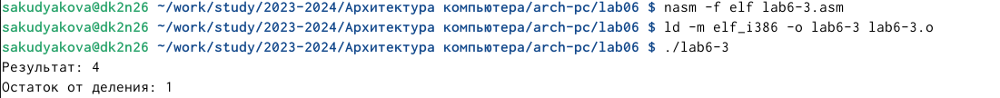{#fig:18 width=70%}
 
 Изменяю программу так, чтобы она вычисляла значение выражения f(x) = (4 * 6 + 2)/5. (рис. @fig:19).

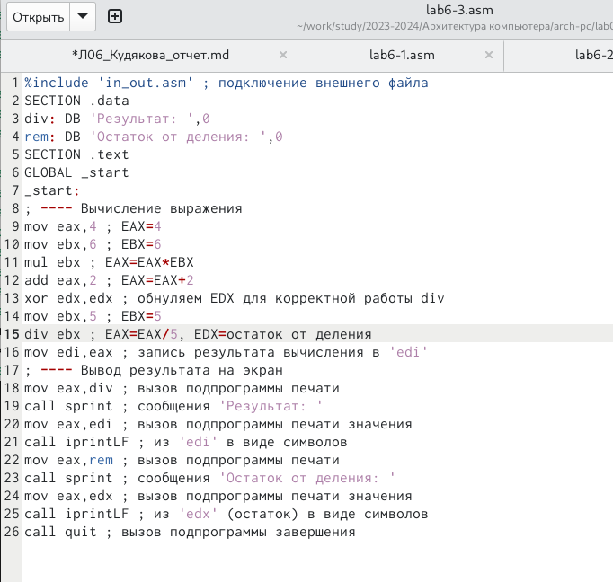{#fig:19 width=70%}

 Создаю исполняемый файл и запускаю его. Программа рабоает верно, так как я самостоятельно посчитала значение выражения, которое, в свою очередь, совпало с выводом программы. (рис. @fig:20).

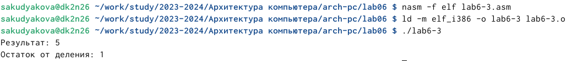{#fig:20 width=70%}

 Создаю файл variant.asm. (рис. @fig:21).

{#fig:21 width=70%}

 Ввожу в файл текст программы для вычисления варианта задания по номеру студенческого билета. (рис. @fig:22).

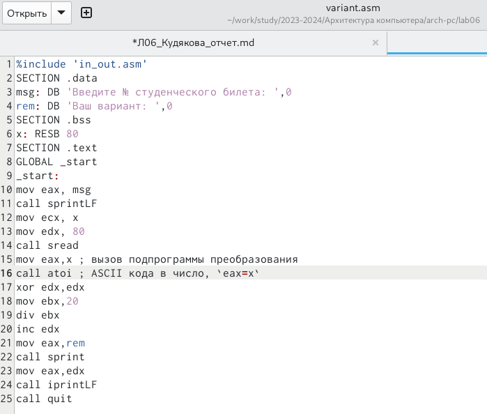{#fig:22 width=70%}

 Создаю исполняемый файл и запускаю его. Ввожу номер своего студенческого билета, программа вчислила, что мой вариант - 14. (рис. @fig:23).

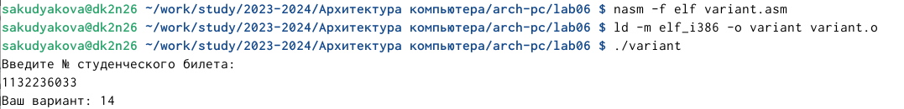{#fig:23 width=70%}
  
### Ответы на вопросы по программе

1. За вывод сообщения “Ваш вариант” отвечают строки кода:

mov eax,rem
call sprint


2. Инструкция mov ecx, x используется, чтобы положить адрес вводимой стро-
ки x в регистр ecx mov edx, 80 - запись в регистр edx длины вводимой строки
call sread - вызов подпрограммы из внешнего файла, обеспечивающей ввод
сообщения с клавиатуры
3. call atoi используется для вызова подпрограммы из внешнего файла, кото-
рая преобразует ascii-код символа в целое число и записывает результат в
регистр eax
4. За вычисления варианта отвечают строки:

```NASM
xor edx,edx ; обнуление edx для корректной работы div
mov ebx,20 ; ebx = 20
div ebx ; eax = eax/20, edx - остаток от деления
inc edx ; edx = edx + 1
```

5. При выполнении инструкции div ebx остаток от деления записывается в
регистр edx
6. Инструкция inc edx увеличивает значение регистра edx на 1
7. За вывод на экран результатов вычислений отвечают строки:

```NASM
mov eax,edx
call iprintLF
```

## Выполнение заданий для самостоятельной работы

 Создаю файл lab6-4.asm. (рис. @fig:24).

{#fig:24 width=70%}

 Из данных выражений я выбрала выражение №8 - (11 + x) * 2 - 6. Ввожу в файл текст программы для вычисления значения выражения (рис. @fig:25).

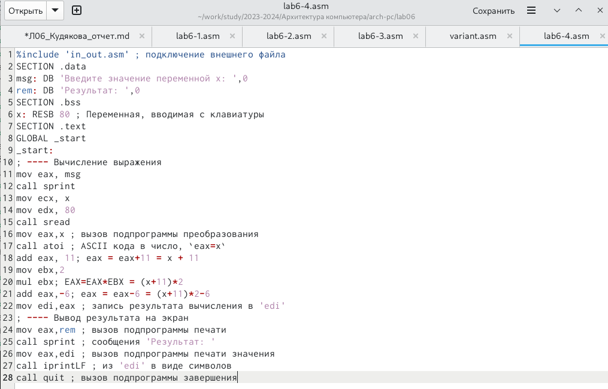{#fig:25 width=70%}

 Создаю исполняемый файл и запускаю его. Если задать переменной х значение 3, то вывод - 22. (рис. @fig:26).
 
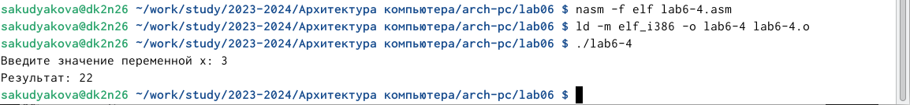{#fig:26 width=70%}

 Для проверки работы программы ввожу другое значение х. (рис. 4.27). Программа отработала верно.

{#fig:27 width=70%}

**Листинг 4.1. Программа для вычисления значения выражения (11 + x) * 2− 6.**

```NASM
%include 'in_out.asm' ; подключение внешнего файла
SECTION .data
msg: DB 'Введите значение переменной x: ',0
rem: DB 'Результат: ',0
SECTION .bss
x: RESB 80 ; Переменная, вводимая с клавиатуры 
SECTION .text
GLOBAL _start
_start:
; ---- Вычисление выражения
mov eax, msg
call sprint
mov ecx, x
mov edx, 80
call sread
mov eax,x ; вызов подпрограммы преобразования
call atoi ; ASCII кода в число, `eax=x`
add eax, 11; eax = eax+11 = x + 11
mov ebx,2
mul ebx; EAX=EAX*EBX = (x+11)*2
add eax,-6; eax = eax-6 = (x+11)*2-6
mov edi,eax ; запись результата вычисления в 'edi'
; ---- Вывод результата на экран
mov eax,rem ; вызов подпрограммы печати
call sprint ; сообщения 'Результат: '
mov eax,edi ; вызов подпрограммы печати значения
call iprintLF ; из 'edi' в виде символов
call quit ; вызов подпрограммы завершения
```

# Выводы

 В ходе данной лабораторной работы я научилась пользоваться арифметическими инструкциями языка ассемблера NASM.

# Список литературы{.unnumbered}

 [Архитектура ЭВМ](https://esystem.rudn.ru/pluginfile.php/2089086/mod_resource/content/0/%D0%9B%D0%B0%D0%B1%D0%BE%D1%80%D0%B0%D1%82%D0%BE%D1%80%D0%BD%D0%B0%D1%8F%20%D1%80%D0%B0%D0%B1%D0%BE%D1%82%D0%B0%20%E2%84%966.%20%D0%90%D1%80%D0%B8%D1%84%D0%BC%D0%B5%D1%82%D0%B8%D1%87%D0%B5%D1%81%D0%BA%D0%B8%D0%B5%20%D0%BE%D0%BF%D0%B5%D1%80%D0%B0%D1%86%D0%B8%D0%B8%20%D0%B2%20NASM..pdfu)
