---
## Front matter
title: "Отчёт по лабораторной работе №7"
subtitle: "Дисциплина: Архитектура компьютера"
author: "София Андреевна Кудякова"

## Generic otions
lang: ru-RU
toc-title: "Содержание"

## Bibliography
bibliography: bib/cite.bib
csl: pandoc/csl/gost-r-7-0-5-2008-numeric.csl

## Pdf output format
toc: true # Table of contents
toc-depth: 2
lof: true # List of figures

fontsize: 12pt
linestretch: 1.5
papersize: a4
documentclass: scrreprt
## I18n polyglossia
polyglossia-lang:
  name: russian
  options:
	- spelling=modern
	- babelshorthands=true
polyglossia-otherlangs:
  name: english
## I18n babel
babel-lang: russian
babel-otherlangs: english
## Fonts
mainfont: PT Serif
romanfont: PT Serif
sansfont: PT Sans
monofont: PT Mono
mainfontoptions: Ligatures=TeX
romanfontoptions: Ligatures=TeX
sansfontoptions: Ligatures=TeX,Scale=MatchLowercase
monofontoptions: Scale=MatchLowercase,Scale=0.9
## Biblatex
biblatex: true
biblio-style: "gost-numeric"
biblatexoptions:
  - parentracker=true
  - backend=biber
  - hyperref=auto
  - language=auto
  - autolang=other*
  - citestyle=gost-numeric
## Pandoc-crossref LaTeX customization
figureTitle: "Рис."
tableTitle: "Таблица"
listingTitle: "Листинг"
lofTitle: "Список иллюстраций"

lolTitle: "Листинги"
## Misc options
indent: true
header-includes:
  - \usepackage{indentfirst}
  - \usepackage{float} # keep figures where there are in the text
  - \floatplacement{figure}{H} # keep figures where there are in the text
---

# Цель работы

 Цель данной лабораторной работы - изучить команды условного и безусловного переходов, научиться писать программы с использованием переходов, а также ознакомиться с назначением и структурой файла листинга.

# Задания

1. Реализация переходов в NASM
2. Изучение структуры файлы листинга
3. Выполнение заданий для самостоятельной работы


# Теоретическое введение

 Для реализации ветвлений в ассемблере используются так называемые команды передачи
управления или команды перехода. Можно выделить 2 типа переходов: 1. Условный переход – выполнение или не выполнение перехода в определенную точку программы в зависимости от проверки условия. 2. Безусловный переход – выполнение передачи управления в определенную точку программы без каких-либо условий. Безусловный переход выполняется инструкцией jmp (от англ. jump – прыжок), которая включает в себя адрес перехода, куда следует передать управление: jmp <адрес_перехода> Адрес перехода может быть либо меткой, либо адресом области памяти, в которую предварительно помещен указатель перехода. Кроме того, в качестве операнда можно использовать имя регистра, в таком случае переход будет осуществляться по адресу, хранящемуся в этом регистре. Для условного перехода необходима проверка какого-либо условия. В ассемблере команды условного перехода вычисляют условие перехода анализируя флаги из регистра флагов. Флаг – это бит, принимающий значение 1 («флаг установлен»), если выполнено некоторое условие, и значение 0 («флаг сброшен») в противном случае. Флаги работают независимо друг от друга, и лишь для удобства они помещены в единый регистр — регистр флагов, отражающий текущее состояние процессора. В следующей таблице указано положение битовых флагов в регистре флагов. Флаги состояния (биты 0, 2, 4, 6, 7 и 11) отражают результат выполнения арифметических инструкций, таких как ADD, SUB, MUL, DIV.Инструкция cmp является одной из инструкций, которая позволяет сравнить операнды и выставляет флаги в зависимости от результата сравнения. Инструкция cmp является командой сравнения двух операндов и имеет такой же формат, как и команда вычитания: 
cmp <операнд_1>, <операнд_2>
Команда cmp, так же как и команда вычитания, выполняет вычитание <операнд_2> - <операнд_1>, но результат вычитания никуда не записывается и единственным результатом команды сравнения является формирование флагов.
Примеры:
```NASM
cmp ax,'4' ; сравнение регистра ax с символом 4
cmp ax,4 ; сравнение регистра ax со значением 4
cmp al,cl ; сравнение регистров al и cl
cmp [buf],ax ; сравнение переменной buf с регистром ax
```
Команда условного перехода имеет вид:
j<мнемоника перехода> label
Мнемоника перехода связана со значением анализируемых флагов или со способом формирования этих флагов.
Листинг (в рамках понятийного аппарата NASM) — это один из выходных файлов, создаваемых транслятором. Он имеет текстовый вид и нужен при отладке программы, так как кроме строк самой программы он содержит дополнительную информацию.

# Выполнение лабораторной работы
## Реализация переходов в NASM

 Ввожу команду mkdir, с помощью которой создаю директорию, в которой буду создавать файлы. Перехожу в нее. (рис. @fig:1).

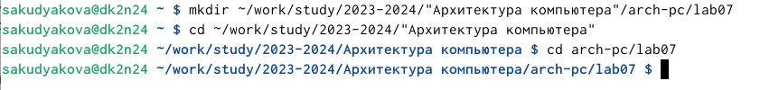{#fig:1 width=70%}

 С помощью команды touch создаю файл lab7-1.asm. (рис. @fig:2).
 
{#fig:2 width=70%}

 Открываю созданный файл в редакторе и вставляю в него программу с использованием инструкции jmp. (рис. @fig:3).

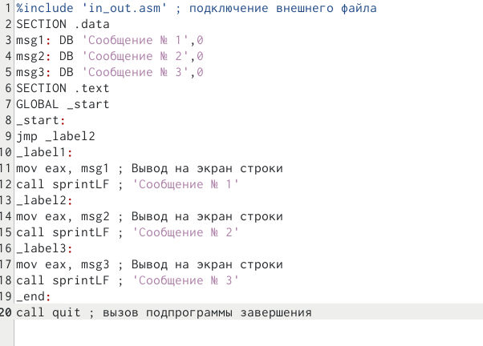{#fig:3 width=70%}

 Создаю исполняемый файл и запускаю его. Программа сработала корректно. (рис. @fig:4).

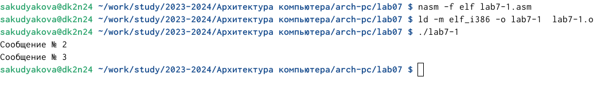{#fig:4 width=70%}

 Инструкция jmp позволяет осуществлять переходы не только вперед но и назад. Изменяю программу таким образом, чтобы она выводила сначала ‘Сообщение № 2’, потом ‘Сообщение № 1’ и завершала работу. Для этого в текст программы после вывода сообщения № 2 добавим инструкцию jmp с меткой _label1 (т.е. переход к инструкциям вывода сообщения № 1) и после вывода сообщения № 1 добавим инструкцию jmp с меткой _end (т.е. переход к инструкции call quit). (рис. @fig:5). 

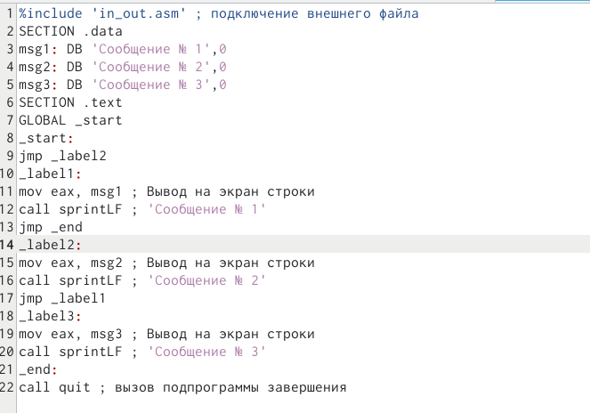{#fig:5 width=70%}

 Создаю исполняемый файл и запускаю его. Программа отработала верно.(рис. @fig:6).
  
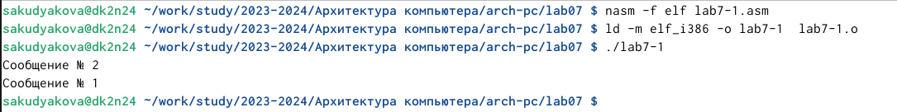{#fig:6 width=70%}

 Далее изменяю текст программы, добавив и изменив инструкции jmp. (рис. @fig:7).
  
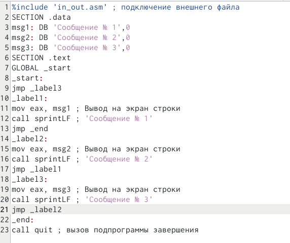{#fig:7 width=70%}

 Создаю исполняемый файл и запускаю его. Вывод верный, значит программа отработала корректно. (рис. @fig:8).

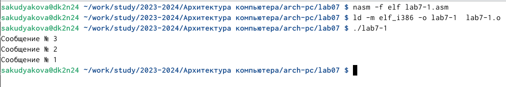{#fig:8 width=70%}
  
 Создаю новый файл lab7-2.asm в каталоге ~/work/arch-pc/lab06. (рис. @fig:9).

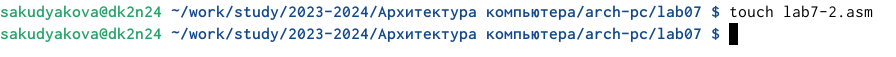{#fig:9 width=70%}

 Ввожу в файл текст ррограмма, которая определяет и выводит на экран наибольшую из 3 целочисленных переменных: A,B и C. (рис. @fig:10).

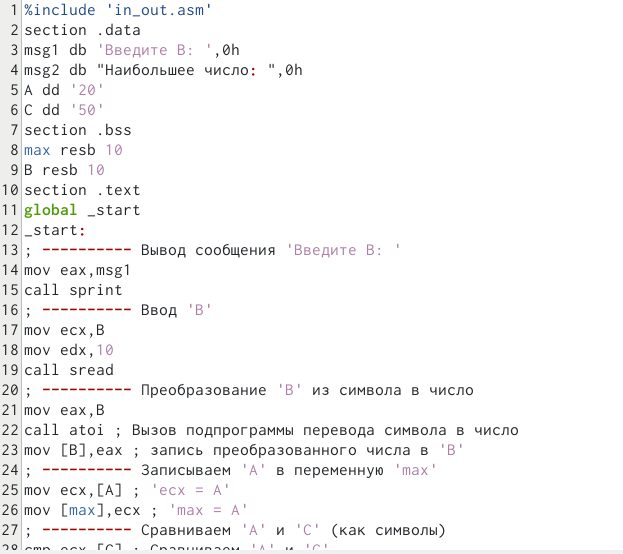{#fig:10 width=70%}

 Создаю исполняемый файл и дважды запускаю его, чтобы проверить корректность работы программы. (рис. @fig:11).

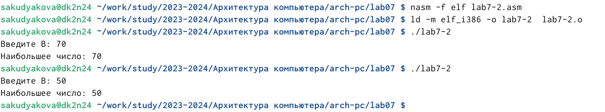{#fig:11 width=70%}

 Программа отработала верно

## Изучение структуры файлы листинга

 Создаю файл листинга для программы из файла lab7-2.asm.  (рис. @fig:12).

{#fig:12 width=70%}

 Открываю файл листинга lab7-2.lst с помощью текстового редактора.(рис. @fig:13).

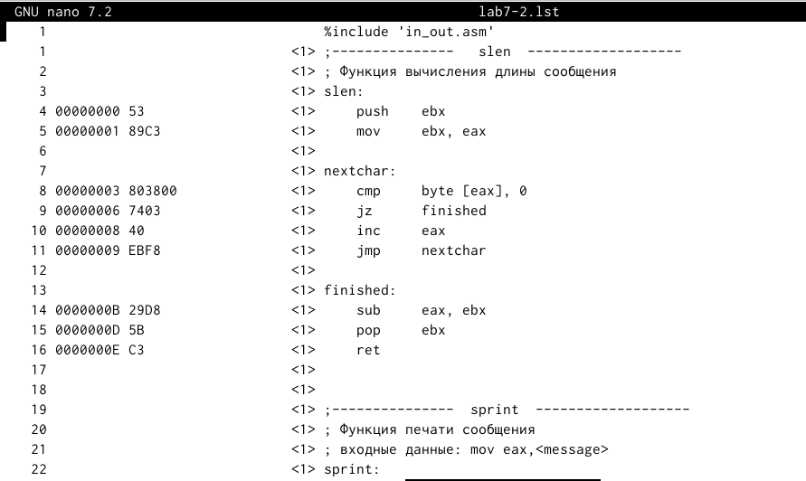{#fig:13 width=70%}

 Для объяснения я выбрала строки 2; 3; 4. (рис. @fig:14).
  
{#fig:14 width=70%}

 Строка "2" - номер строки кода; " ; Функция вычисление длины сообщения" - комментарий к коду, не имеет адреса и машинного кода. Строка "3" - номер строки кода; "slen" - название функции, не имеет адреса и машинного кода. Строка "4" - номер строки кода; "00000000" - адрес строки; "53" - машинный код; "push ebx" - исходный текст программы, push помещает операнд ebx в стек.
 
  Открываю файл с программой lab7-2.asm и в  инструкции с двумя операндами удаляю один операнд(рис. @fig:15).
  
{#fig:15 width=70%}

 Выполняю трансляцию с получением файла листинга. (рис. @fig:16).

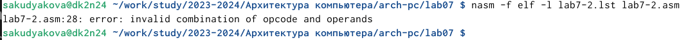{#fig:16 width=70%}

В этом случае не создаются никакие выходные файлы из-за ошибки: инструкция mov не может работать, имея только один операнд. Поэтому код не работает.

## Выполнение заданий для самостоятельной работы
1. Пишу программу нахождения наименьшей из 3 целочисленных переменных a, b и c. Значения переменных выбрать из табл. 7.5 в соответствии с вариантом, полученным при выполнении лабораторной работы № 6. Мой вариант - 14. Мои значения - 81,22,72 (рис. @fig:17).

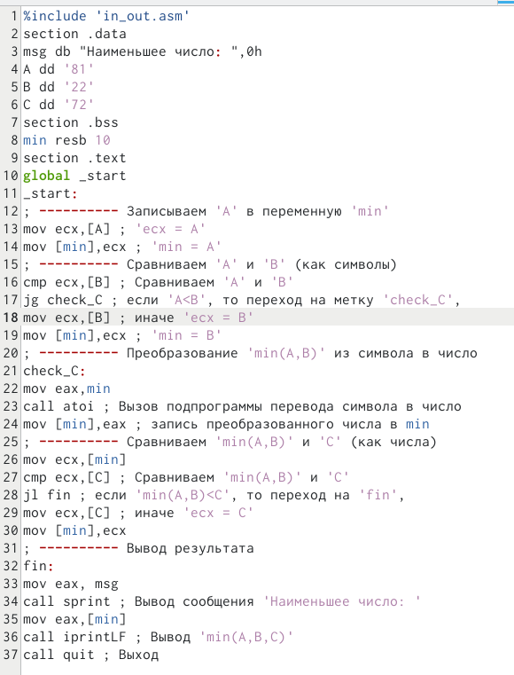{#fig:17 width=70%}

 Создаю исполняемый файл и запускаю его. (рис. @fig:18).
  
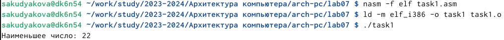{#fig:18 width=70%}

 Программа отработала верно.
 
 
**Листинг 4.2.1. Программа, которая определяет и выводит на экран наименьшую из 3 целочисленных переменных: A,B и C**
```NASM
%include 'in_out.asm'

section .data
msg db "Наименьшее число: ",0h
A dd '81'
B dd '22'
C dd '72'
section .bss
min resb 10
section .text
global _start
_start:
; ---------- Записываем 'A' в переменную 'min'
mov ecx,[A] ; 'ecx = A'
mov [min],ecx ; 'min = A'
; ---------- Сравниваем 'A' и 'B' (как символы)
cmp ecx,[B] ; Сравниваем 'A' и 'B'
jg check_C ; если 'A<B', то переход на метку 'check_C',
mov ecx,[B] ; иначе 'ecx = B'
mov [min],ecx ; 'min = B'
; ---------- Преобразование 'min(A,B)' из символа в число
check_C:
mov eax,min
call atoi ; Вызов подпрограммы перевода символа в число
mov [min],eax ; запись преобразованного числа в min
; ---------- Сравниваем 'min(A,B)' и 'C' (как числа)
mov ecx,[min]
cmp ecx,[C] ; Сравниваем 'min(A,B)' и 'C'
jl fin ; если 'min(A,B)<C', то переход на 'fin',
mov ecx,[C] ; иначе 'ecx = C'
mov [min],ecx
; ---------- Вывод результата
fin:
mov eax, msg
call sprint ; Вывод сообщения 'Наименьшее число: '
mov eax,[min]
call iprintLF ; Вывод 'min(A,B,C)'
call quit ; Выход
```

2. Пишу программу, которая для введенных с клавиатуры значений x и a вычисляет значение заданной функции f(x) и выводит результат вычислений. Вид функции f(x) выбираю в соответствие с вариантом, полученным при выполнении лабораторной работы №6. Мой вариант 14, выбираю выражение для f(x) под номером 14. (рис. @fig:19).

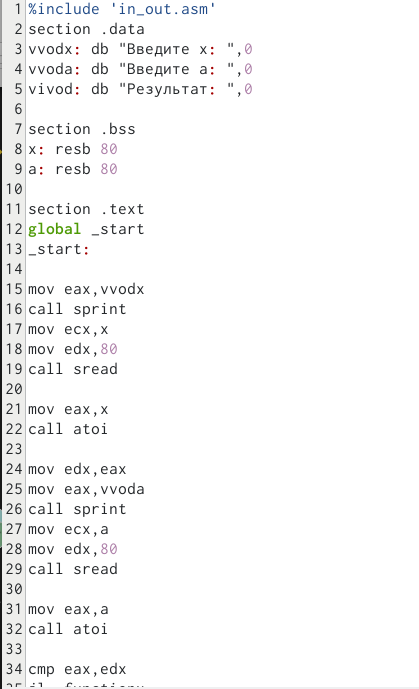{#fig:19 width=70%}

 Создаю исполняемый файл и запускаю его. Ввожу сначала значения 2 и 3 (рис. @fig:20).

{#fig:20 width=70%}

 Затем ввожу значения 4 и 2. (рис. @fig:21).
 
{#fig:21 width=70%}

 Программа рабоает верно

**Листинг 4.2.2. Программа для вычисления значения заданной функции**
```NASM
%include 'in_out.asm'
section .data
vvodx: db "Введите x: ",0
vvoda: db "Введите а: ",0
vivod: db "Результат: ",0

section .bss
x: resb 80
a: resb 80

section .text
global _start
_start:

mov eax,vvodx
call sprint
mov ecx,x
mov edx,80
call sread

mov eax,x
call atoi

mov edx,eax
mov eax,vvoda
call sprint
mov ecx,a
mov edx,80
call sread

mov eax,a
call atoi

cmp eax,edx
jl _functionx
jmp _functiona

_functiona:
mov edx,3
mul edx
add eax,1
jmp _end

_functionx:
mov edx,3
mul edx
add eax,1
jmp _end

_end:
mov ecx,eax
mov eax,vivod
call sprint
mov eax,ecx
call iprintLF
call quit
```
# Выводы

 В ходе данной лабораторной работы я изучила команды условного и безусловного переходов, научилась писать программы с использованием переходов, а также ознакомилась с назначением и структурой файла листинга.

# Список литературы{.unnumbered}

 [Архитектура ЭВМ](https://esystem.rudn.ru/pluginfile.php/2089087/mod_resource/content/0/%D0%9B%D0%B0%D0%B1%D0%BE%D1%80%D0%B0%D1%82%D0%BE%D1%80%D0%BD%D0%B0%D1%8F%20%D1%80%D0%B0%D0%B1%D0%BE%D1%82%D0%B0%20%E2%84%967.%20%D0%9A%D0%BE%D0%BC%D0%B0%D0%BD%D0%B4%D1%8B%20%D0%B1%D0%B5%D0%B7%D1%83%D1%81%D0%BB%D0%BE%D0%B2%D0%BD%D0%BE%D0%B3%D0%BE%20%D0%B8%20%D1%83%D1%81%D0%BB%D0%BE%D0%B2%D0%BD%D0%BE%D0%B3%D0%BE%20%D0%BF%D0%B5%D1%80%D0%B5%D1%85%D0%BE%D0%B4%D0%BE%D0%B2%20%D0%B2%20Nasm.%20%D0%9F%D1%80%D0%BE%D0%B3%D1%80%D0%B0%D0%BC%D0%BC%D0%B8%D1%80%D0%BE%D0%B2%D0%B0%D0%BD%D0%B8%D0%B5%20%D0%B2%D0%B5%D1%82%D0%B2%D0%BB%D0%B5%D0%BD%D0%B8%D0%B9..pdf)
