---
## Front matter
title: "Отчёт по лабораторной работе №8"
subtitle: "Дисциплина: Архитектура компьютера"
author: "София Андреевна Кудякова"

## Generic otions
lang: ru-RU
toc-title: "Содержание"

## Bibliography
bibliography: bib/cite.bib
csl: pandoc/csl/gost-r-7-0-5-2008-numeric.csl

## Pdf output format
toc: true # Table of contents
toc-depth: 2
lof: true # List of figures

fontsize: 12pt
linestretch: 1.5
papersize: a4
documentclass: scrreprt
## I18n polyglossia
polyglossia-lang:
  name: russian
  options:
	- spelling=modern
	- babelshorthands=true
polyglossia-otherlangs:
  name: english
## I18n babel
babel-lang: russian
babel-otherlangs: english
## Fonts
mainfont: PT Serif
romanfont: PT Serif
sansfont: PT Sans
monofont: PT Mono
mainfontoptions: Ligatures=TeX
romanfontoptions: Ligatures=TeX
sansfontoptions: Ligatures=TeX,Scale=MatchLowercase
monofontoptions: Scale=MatchLowercase,Scale=0.9
## Biblatex
biblatex: true
biblio-style: "gost-numeric"
biblatexoptions:
  - parentracker=true
  - backend=biber
  - hyperref=auto
  - language=auto
  - autolang=other*
  - citestyle=gost-numeric
## Pandoc-crossref LaTeX customization
figureTitle: "Рис."
tableTitle: "Таблица"
listingTitle: "Листинг"
lofTitle: "Список иллюстраций"

lolTitle: "Листинги"
## Misc options
indent: true
header-includes:
  - \usepackage{indentfirst}
  - \usepackage{float} # keep figures where there are in the text
  - \floatplacement{figure}{H} # keep figures where there are in the text
---

# Цель работы

 Цель данной лабораторной работы - научиться писать программы с использованием циклов и обработкой
аргументов командной строки.

# Задания

1. Реализация циклов в NASM
2. Обработка аргументов командной строки
3. Выполнение заданий для самостоятельной работы


# Теоретическое введение

 Стек — это структура данных, организованная по принципу LIFO («Last In — First Out» или «последним пришёл — первым ушёл»). Стек является частью архитектуры процессора и реализован на аппаратном уровне. Для работы со стеком в процессоре есть специальные регистры (ss, bp, sp) и команды. Основной функцией стека является функция сохранения адресов возврата и передачи аргументов при вызове процедур. Кроме того, в нём выделяется память для локальных переменных и могут временно храниться значения регистров. Стек имеет вершину, адрес последнего добавленного элемента, который хранится в регистре esp (указатель стека). Противоположный конец стека называется дном. Значение, помещённое в стек последним, извлекается первым. При помещении значения в стек указатель стека уменьшается, а при извлечении — увеличивается.Для стека существует две основные операции: добавление элемента в вершину стека (push) и извлечение элемента из вершины стека (pop).Команда push размещает значение в стеке, т.е. помещает значение в ячейку памяти, на которую указывает регистр esp, после этого значение регистра esp увеличивается на 4. Данная команда имеет один операнд — значение, которое необходимо поместить в стек.
```NASM
push -10 ; Поместить -10 в стек
push ebx ; Поместить значение регистра ebx в стек
push [buf] ; Поместить значение переменной buf в стек
push word [ax] ; Поместить в стек слово по адресу в ax
```
Существует ещё две команды для добавления значений в стек. Это команда pusha, которая помещает в стек содержимое всех регистров общего назначения в следующем порядке: ах, сх, dx, bх, sp, bp, si, di. А также команда pushf, которая служит для перемещения в стек содержимого регистра флагов. Обе эти команды не имеют операндов. Команда pop извлекает значение из стека, т.е. извлекает значение из ячейки памяти, на которую указывает регистр esp, после этого уменьшает значение регистра esp на 4. У этой команды также один операнд, который может быть регистром или переменной в памяти. Нужно помнить, что извлечённый из стека элемент не стирается из памяти и остаётся как “мусор”, который будет перезаписан при записи нового значения в стек.
```NASM
pop eax ; Поместить значение из стека в регистр eax
pop [buf] ; Поместить значение из стека в buf
pop word[si] ; Поместить значение из стека в слово по адресу в si
```
Для организации циклов существуют специальные инструкции. Для всех инструкций максимальное количество проходов задаётся в регистре ecx. Наиболее простой является инструкция loop. Она позволяет организовать безусловный цикл, типичная структура которого имеет следующий вид:
```NASM
mov ecx, 100 ; Количество проходов
NextStep:
...
... ; тело цикла
...
loop NextStep ; Повторить `ecx` раз от метки NextStep
```
Иструкция loop выполняется в два этапа. Сначала из регистра ecx вычитается единица и его значение сравнивается с нулём. Если регистр не равен нулю, то выполняется переход к указанной метке. Иначе переход не выполняется и управление передаётся команде, которая следует сразу после команды loop.

# Выполнение лабораторной работы
## Реализация циклов в NASM

 Ввожу команду mkdir, с помощью которой создаю директорию, в которой буду создавать файлы. Перехожу в нее. С помощью команды touch создаю файл lab8-1.asm. (рис. @fig:1).

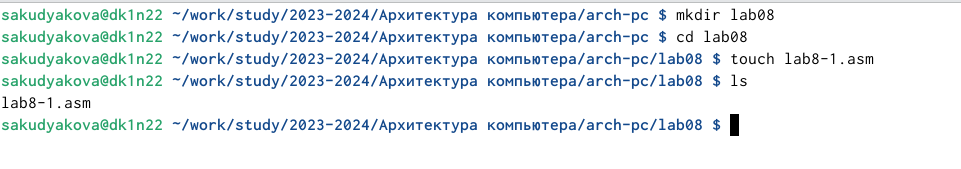{#fig:1 width=70%}

 Открываю созданный файл в редакторе и вставляю в него программу вывода значений регистра ecx. (рис. @fig:2).
 
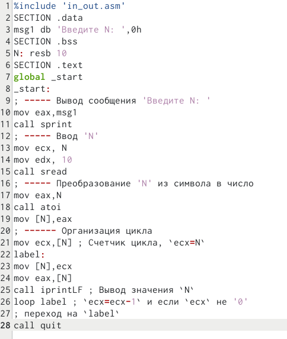{#fig:2 width=70%}

 Создаю исполняемый файл и запускаю его. (рис. @fig:3).

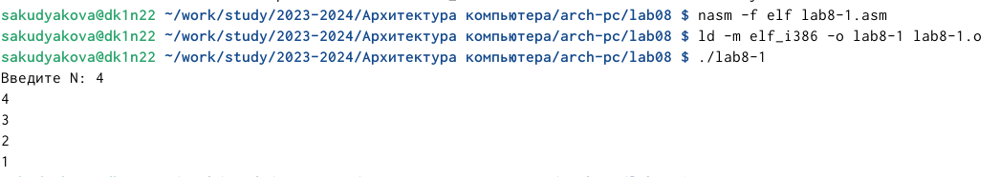{#fig:3 width=70%}

 Программа выводит числа от N до 1.

 Изменяю текст программы, добавив изменение значение регистра ecx в цикле. (рис. @fig:4).

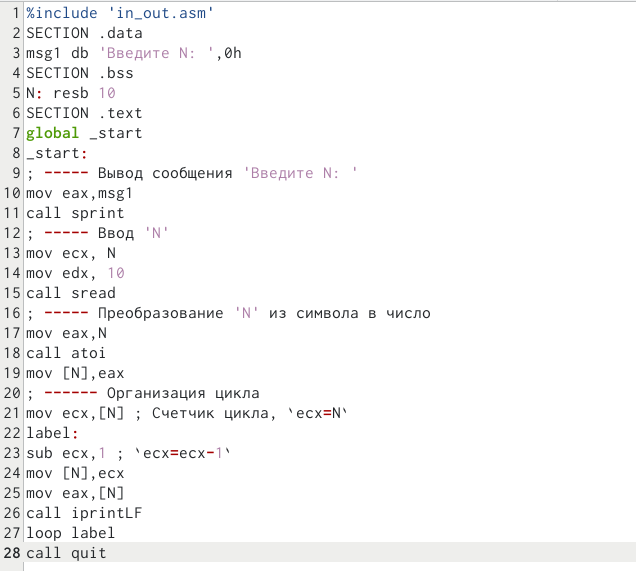{#fig:4 width=70%}

 Создаю исполняемый файл и запускаю его. (рис. @fig:5). 

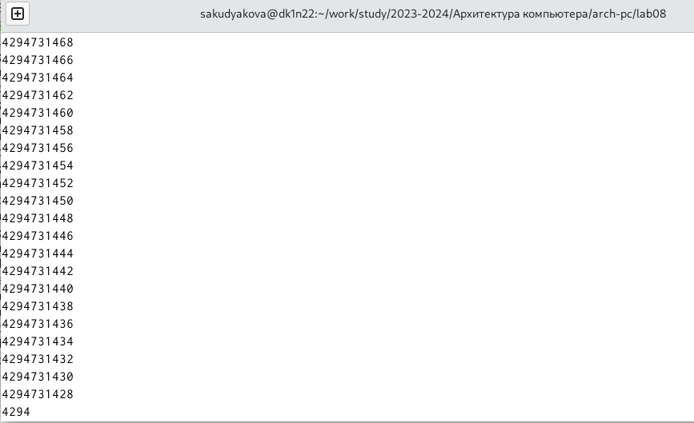{#fig:5 width=70%}

 Число проходов цикла не соответствует значению N, введенному с клавиатуры.

 Измененяю текст программы, добавив команды push и pop (добавления в стек и извлечения из стека) для сохранения значения счетчика цикла loop.(рис. @fig:6).
  
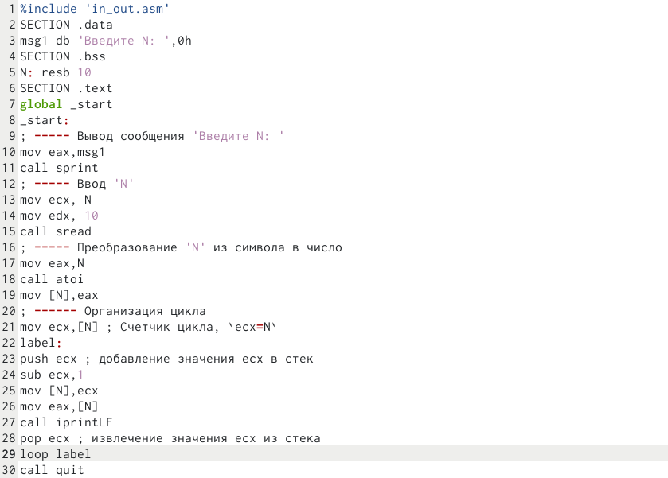{#fig:6 width=70%}

 Создаю исполняемый файл и запускаю его. (рис. @fig:7).
  
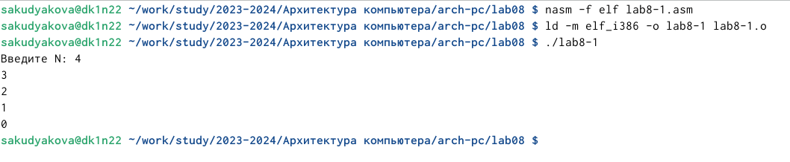{#fig:7 width=70%}

  В данном случае число проходов цикла соответсвует значению N, введенному с клавиатуры. Программа выводит числа от N до 0.
  
## Обработка аргументов командной строки

 Создаю новый файл lab8-2.asm в каталоге ~/work/arch-pc/lab08. (рис. @fig:8).

{#fig:8 width=70%}
  
 Ввожу в файл текст программы, выводящая на экран аргументы командной строки. (рис. @fig:9).

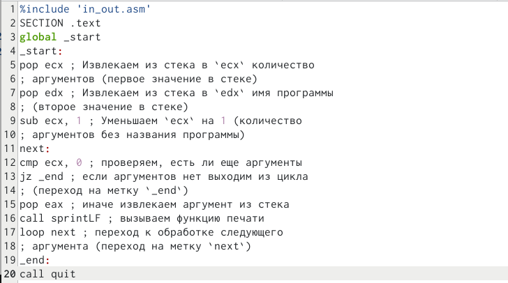{#fig:9 width=70%}

 Создаю исполняемый файл и запускаю его, указав аргументы. (рис. @fig:10).

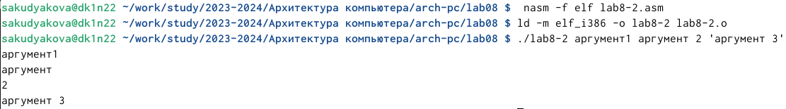{#fig:10 width=70%}

 Программа обработала 4 аргумента.

 Создаю новый файл lab8-3.asm в каталоге ~/work/arch-pc/lab08. (рис. @fig:11).

{#fig:11 width=70%}

 Ввожу в файл текст программы вычисления суммы аргументов командной строки. (рис. @fig:12).

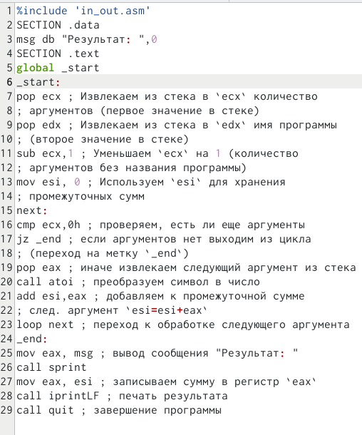{#fig:12 width=70%}

 Создаю исполняемый файл и запускаю его, указав аргументы.(рис. @fig:13).

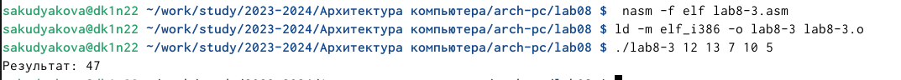{#fig:13 width=70%}

 Программа отработала корректно.

 Изменяю текст программы для вычисления произведения аргументов командной строки. (рис. @fig:14).
  
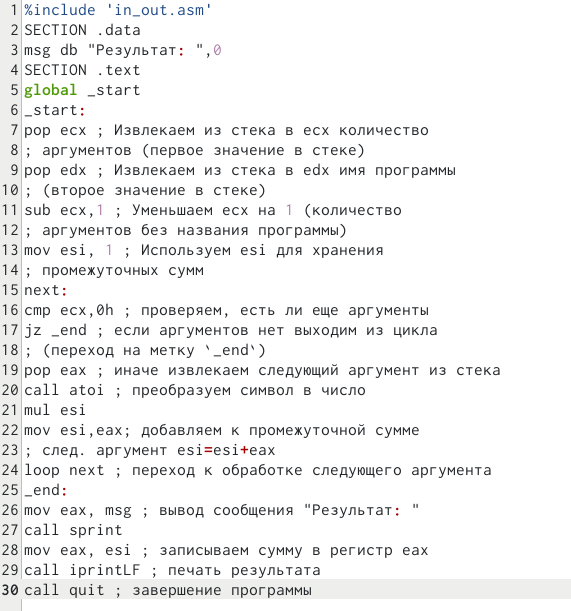{#fig:14 width=70%}

 Создаю исполняемый файл и запускаю его, указав аргументы. (рис. @fig:15).
  
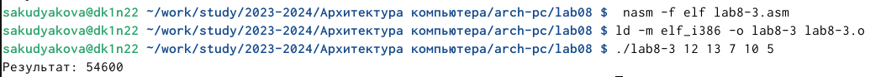{#fig:15 width=70%}

Программа верно посчитала произведение аргументов.

**Листинг 4.2.1. Программы для вычисления произведения аргументов командной строки.**
```NASM
%include 'in_out.asm'
SECTION .data
msg db "Результат: ",0
SECTION .text
global _start
_start:
pop ecx ; Извлекаем из стека в ecx количество
; аргументов (первое значение в стеке)
pop edx ; Извлекаем из стека в edx имя программы
; (второе значение в стеке)
sub ecx,1 ; Уменьшаем ecx на 1 (количество
; аргументов без названия программы)
mov esi, 1 ; Используем esi для хранения
; промежуточных сумм
next:
cmp ecx,0h ; проверяем, есть ли еще аргументы
jz _end ; если аргументов нет выходим из цикла
; (переход на метку `_end`)
pop eax ; иначе извлекаем следующий аргумент из стека
call atoi ; преобразуем символ в число
mul esi
mov esi,eax; добавляем к промежуточной сумме
; след. аргумент esi=esi+eax
loop next ; переход к обработке следующего аргумента
_end:
mov eax, msg ; вывод сообщения "Результат: "
call sprint
mov eax, esi ; записываем сумму в регистр eax
call iprintLF ; печать результата
call quit ; завершение программы
```

## Выполнение заданий для самостоятельной работы
 
 Создаю файл lab8-4.asm, в котором буду писать программу. (рис. @fig:16).

{#fig:16 width=70%}

 Пишу программу которая находит сумму значений функции 𝑓(𝑥) для𝑥 = 𝑥1, 𝑥2, ..., 𝑥𝑛, т.е. программа должна выводить значение f(x1) + f(x2) + ... + f(xn). Значения xi передаются как аргументы. Вид функции f(x) выбрать в соответствии с вариантом, полученным при выполнении лабораторной работы № 7. Мой вариант 14 - 7(x+1).(рис. @fig:17).

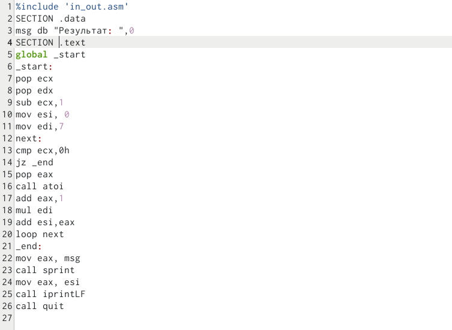{#fig:17 width=70%}

 Создаю исполняемый файл и запускаю его. (рис. @fig:18).
  
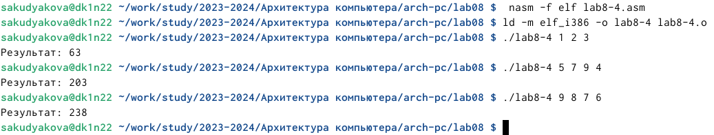{#fig:18 width=70%}

 Программа отработала верно.
 
**Листинг 4.2.2. Программа для нахождения суммы значений функций**
```NASM
%include 'in_out.asm'
SECTION .data
msg db "Результат: ",0
SECTION .text
global _start
_start:
pop ecx
pop edx
sub ecx,1
mov esi, 0
mov edi,7
next:
cmp ecx,0h
jz _end
pop eax
call atoi
add eax,1
mul edi
add esi,eax
loop next
_end:
mov eax, msg
call sprint
mov eax, esi
call iprintLF
call quit 
```

# Выводы

 В ходе данной лабораторной работы я научилась писать программы с использованием циклов и обработкой
аргументов командной строки.

# Список литературы{.unnumbered}

 [Архитектура ЭВМ](https://esystem.rudn.ru/pluginfile.php/2089095/mod_resource/content/0/%D0%9B%D0%B0%D0%B1%D0%BE%D1%80%D0%B0%D1%82%D0%BE%D1%80%D0%BD%D0%B0%D1%8F%20%D1%80%D0%B0%D0%B1%D0%BE%D1%82%D0%B0%20%E2%84%968.%20%D0%9F%D1%80%D0%BE%D0%B3%D1%80%D0%B0%D0%BC%D0%BC%D0%B8%D1%80%D0%BE%D0%B2%D0%B0%D0%BD%D0%B8%D0%B5%20%D1%86%D0%B8%D0%BA%D0%BB%D0%B0.%20%D0%9E%D0%B1%D1%80%D0%B0%D0%B1%D0%BE%D1%82%D0%BA%D0%B0%20%D0%B0%D1%80%D0%B3%D1%83%D0%BC%D0%B5%D0%BD%D1%82%D0%BE%D0%B2%20%D0%BA%D0%BE%D0%BC%D0%B0%D0%BD%D0%B4%D0%BD%D0%BE%D0%B9%20%D1%81%D1%82%D1%80%D0%BE%D0%BA%D0%B8..pdf)
