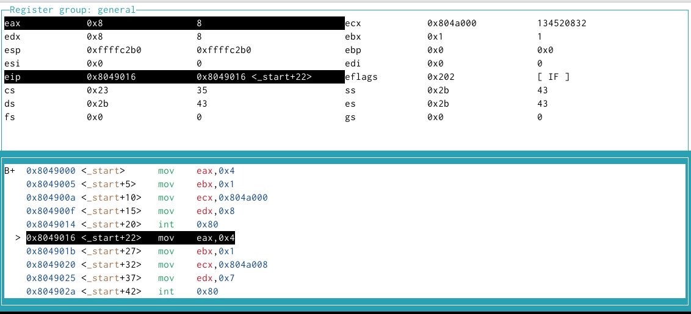
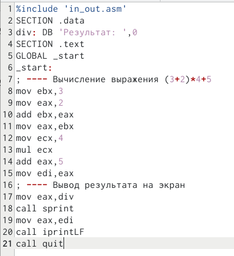
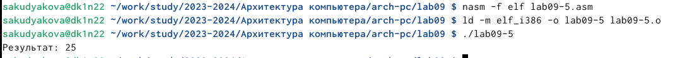

---
## Front matter
title: "Отчёт по лабораторной работе №9"
subtitle: "Дисциплина: Архитектура компьютера"
author: "София Андреевна Кудякова"

## Generic otions
lang: ru-RU
toc-title: "Содержание"

## Bibliography
bibliography: bib/cite.bib
csl: pandoc/csl/gost-r-7-0-5-2008-numeric.csl

## Pdf output format
toc: true # Table of contents
toc-depth: 2
lof: true # List of figures

fontsize: 12pt
linestretch: 1.5
papersize: a4
documentclass: scrreprt
## I18n polyglossia
polyglossia-lang:
  name: russian
  options:
	- spelling=modern
	- babelshorthands=true
polyglossia-otherlangs:
  name: english
## I18n babel
babel-lang: russian
babel-otherlangs: english
## Fonts
mainfont: PT Serif
romanfont: PT Serif
sansfont: PT Sans
monofont: PT Mono
mainfontoptions: Ligatures=TeX
romanfontoptions: Ligatures=TeX
sansfontoptions: Ligatures=TeX,Scale=MatchLowercase
monofontoptions: Scale=MatchLowercase,Scale=0.9
## Biblatex
biblatex: true
biblio-style: "gost-numeric"
biblatexoptions:
  - parentracker=true
  - backend=biber
  - hyperref=auto
  - language=auto
  - autolang=other*
  - citestyle=gost-numeric
## Pandoc-crossref LaTeX customization
figureTitle: "Рис."
tableTitle: "Таблица"
listingTitle: "Листинг"
lofTitle: "Список иллюстраций"

lolTitle: "Листинги"
## Misc options
indent: true
header-includes:
  - \usepackage{indentfirst}
  - \usepackage{float} # keep figures where there are in the text
  - \floatplacement{figure}{H} # keep figures where there are in the text
---

# Цель работы

 Цель данной лабораторной работы - научиться писать программы с использованием подпрограмм, а также ознакомиться с методами отладки при помощи GDB и его основными возможностями.

# Задания

1. Реализация подпрограмм в NASM
2. Откладка программам с помощью GDB
3. Добавление точек останова
4. Работа с данными программы в GDB
5. Обработка аргументов командной строки в GDB
6. Выполнение заданий для самостоятельной работы


# Теоретическое введение

 Отладка — это процесс поиска и исправления ошибок в программе. В общем случае его можно разделить на четыре этапа: обнаружение ошибки; поиск её местонахождения; определение причины ошибки; исправление ошибки.
Можно выделить следующие типы ошибок: синтаксические ошибки — обнаруживаются во время трансляции исходного кода и вызваны нарушением ожидаемой формы или структуры языка; семантические ошибки — являются логическими и приводят к тому, что программа запускается, отрабатывает, но не даёт желаемого результата; ошибки в процессе выполнения — не обнаруживаются при трансляции и вызывают прерывание выполнения программы (например, это ошибки, связанные с переполнением или делением на ноль). Второй этап — поиск местонахождения ошибки. Некоторые ошибки обнаружить довольно трудно. Лучший способ найти место в программе, где находится ошибка, это разбить программу на части и произвести их отладку отдельно друг от друга. Третий этап — выяснение причины ошибки. После определения местонахождения ошибки обычно проще определить причину неправильной работы программы. Последний этап — исправление ошибки. После этого при повторном запуске программы, может обнаружиться следующая ошибка, и процесс отладки начнётся заново. 
 Наиболее часто применяют следующие методы отладки: создание точек контроля значений на входе и выходе участка программы (например, вывод промежуточных значений на экран — так называемые диагностические сообщения); использование специальных программ-отладчиков. Отладчики позволяют управлять ходом выполнения программы, контролировать и изменять данные. Это помогает быстрее найти место ошибки в программе и ускорить её исправление. Наиболее популярные способы работы с отладчиком — это использование точек останова и выполнение программы по шагам. Пошаговое выполнение — это выполнение программы с остановкой после каждой строчки, чтобы программист мог проверить значения переменных и выполнить другие действия. Точки останова — это специально отмеченные места в программе, в которых программа- отладчик приостанавливает выполнение программы и ждёт команд. Наиболее популярные виды точек останова: Breakpoint — точка останова (остановка происходит, когда выполнение доходит до определённой строки, адреса или процедуры, отмеченной программистом); Watchpoint — точка просмотра (выполнение программы приостанавливается, если программа обратилась к определённой переменной: либо считала её значение, либо изменила его). Точки останова устанавливаются в отладчике на время сеанса работы с кодом программы, т.е. они сохраняются до выхода из программы-отладчика или до смены отлаживаемой программы.
  GDB (GNU Debugger — отладчик проекта GNU) [1] работает на многих UNIX-подобных системах и умеет производить отладку многих языков программирования. GDB предлагаетобширные средства для слежения и контроля за выполнением компьютерных программ. Отладчик не содержит собственного графического пользовательского интерфейса и использует стандартный текстовый интерфейс консоли. Однако для GDB существует несколько сторон- них графических надстроек, а кроме того, некоторые интегрированные среды разработки используют его в качестве базовой подсистемы отладки. Отладчик GDB (как и любой другой отладчик) позволяет увидеть, что происходит «внутри» программы в момент её выполнения или что делает программа в момент сбоя. GDB может выполнять следующие действия: начать выполнение программы, задав всё, что может повлиять на её поведение; остановить программу при указанных условиях; исследовать, что случилось, когда программа остановилась; изменить программу так, чтобы можно было поэкспериментировать с устранением эффектов одной ошибки и продолжить выявление других.
  Синтаксис команды для запуска отладчика имеет следующий вид:
 gdb [опции] [имя_файла | ID процесса]
 После запуска gdb выводит текстовое сообщение — так называемое «nice GDB logo». В следующей строке появляется приглашение (gdb) для ввода команд. Далее приведён список некоторых команд GDB. Команда run (сокращённо r) — запускает отлаживаемую программу в оболочке GDB. Если точки останова не были установлены, то программа выполняется и выводятся сообщения:
```NASM
(gdb) run
Starting program: test
Program exited normally.
(gdb)
```
Если точки останова были заданы, то отладчик останавливается на соответствующей команде и выдаёт номер точки останова, адрес и дополнительную информацию — текущую строку, имя процедуры, и др. Команда kill (сокращённо k) прекращает отладку программы, после чего следует вопрос о прекращении процесса отладки:
 Kill the program being debugged? (y or n) y
Если в ответ введено y (то есть «да»), отладка программы прекращается. Командой run её можно начать заново, при этом все точки останова (breakpoints), точки просмотра (watchpoints) и точки отлова (catchpoints) сохраняются. Для выхода из отладчика используется команда quit (или сокращённо q)
 Установить точку останова можно командой break (кратко b). Типичный аргумент этой команды — место установки. Его можно задать как имя метки или как адрес. Информацию о всех установленных точках останова можно вывести командой info (кратко i). Для того чтобы сделать неактивной какую-нибудь ненужную точку останова, можно воспользоваться командой disable. Обратно точка останова активируется командой enable. Если же точка останова в дальнейшем больше не нужна, она может быть удалена с помощью команды delete. Ввод этой команды без аргумента удалит все точки останова. Информацию о командах этого раздела можно получить, введя
```NASM
help breakpoints
```
Для продолжения остановленной программы используется команда continue (c) (gdb) с [аргумент]. Выполнение программы будет происходить до следующей точки останова. В качестве аргумента может использоваться целое число N, которое указывает отладчику проигнорировать N − 1 точку останова (выполнение остановится на N-й точке). Команда stepi (кратко sI) позволяет выполнять программу по шагам
Архитектура ЭВМ
(gdb) si [аргумент]
При указании в качестве аргумента целого числа N отладчик выполнит команду step N раз при условии, что не будет точек останова или выполнение программы не прервётся по другим причинам. Команда nexti (или ni) аналогична stepi, но вызов процедуры (функции) трактуется отладчиком как одна инструкция.
Информацию о командах этого раздела можно получить, введя
```NASM
(gdb) help running
```
Как уже упоминалось, отладчик может показывать содержимое ячеек памяти и регистров, а при необходимости позволяет вручную изменять значения регистров и переменных. Посмотреть содержимое регистров можно с помощью команды info registers (или i r).
 Подпрограмма — это, как правило, функционально законченный участок кода, который можно многократно вызывать из разных мест программы. В отличие от простых переходов из подпрограмм существует возврат на команду, следующую за вызовом. Если в программе встречается одинаковый участок кода, его можно оформить в виде подпрограммы, а во всех нужных местах поставить её вызов. При этом подпрограмма будет содержаться в коде в одном экземпляре, что позволит уменьшить размер кода всей программы.

# Выполнение лабораторной работы
## Реализация подпрограмм в NASM

 Ввожу команду mkdir, с помощью которой создаю директорию, в которой буду создавать файлы. Перехожу в нее. С помощью команды touch создаю файл lab09-1.asm. (рис. @fig:1).

{#fig:1 width=70%}

 Открываю созданный файл в редакторе и вставляю в него программу с использованием вызова подпрограммы. (рис. @fig:2).
 
{#fig:2 width=70%}

 Создаю исполняемый файл и запускаю его. (рис. @fig:3).

{#fig:3 width=70%}

 Изменяю текст программы, добавив подпрограмму _subcalcul в подпрограмму _calcul, для вычисления выражения f(g(x)), где x вводится с клавиатуры, f(x) = 2x + 7, g(x) = 3x - 1. Т.е. x передается в подпрограмму _calcul из нее в подпрограмму _subcalcul, где вычисляется выражение g(x), результат возвращается в _calcul и вычисляется выражение f(g(x)). Результат возвращается в основную программу для вывода результата на экран. (рис. @fig:4).

{#fig:4 width=70%}

 Создаю исполняемый файл и запускаю его. (рис. @fig:5). 

{#fig:5 width=70%}

## Откладка программам с помощью GDB

 С помощью команды touch создаю файл lab09-2.asm.(рис. @fig:6).
  
{#fig:6 width=70%}

 Ввожу в файл текст программы вывода сообщения Hello world!. (рис. @fig:7).
  
{#fig:7 width=70%}

 Получаю исполняемый файл. Для работы с GDB в исполняемый файл необходимо добавить отладочную информацию, для этого трансляцию программ необходимо проводить с ключом ‘-g’. (рис. @fig:8).

{#fig:8 width=70%}
  
 Проверяю работу программы, запустив ее в оболочке GDB с помощью команды run. (рис. @fig:9).

{#fig:9 width=70%}

 Для более подробного анализа программы установливаю брейкпоинт на метку _start, с которой начинается выполнение любой ассемблерной программы, и запускаю её. (рис. @fig:10).

{#fig:10 width=70%}

 Смотрю дисассимилированный код программы с помощью команды disassemble начиная с метки _start. Переключаюсь на отображение команд с Intel’овским синтаксисом, введя команду set disassembly-flavor intel. (рис. @fig:11).

{#fig:11 width=70%}

 Различия отображения синтаксиса машинных команд в режимах ATT и Intel: в режиме ATT имена регистров начинаются с символа %, а имена операндов с $, в то время как в Intel используется привычный синтаксис.
 
 Включаю режим псевдографики для более удобного анализа программы. (рис. @fig:12).

![Включение режима псевдографики] (image/lab09_12.png){#fig:12 width=70%}

### Добавление точек останова

 На предыдущих шагах была установлена точка останова по имени метки (_start). Проверяю это с помощью команды info breakpoints (кратко i b). Устанавливаю еще одну точку останова по адресу инструкции. Затем смотрю информацию о всех установленных точках останов. (рис. @fig:13).

{#fig:13 width=70%}

### Работа с данными программы в GDB

 Выполняю 5 инструкций с помощью команды stepi (или si) и смотрю за изменением значений регистров. (рис. @fig:14).
  
{#fig:14 width=70%}

 Выполняю 4 остальные инструкции si.(рис. @fig:15).
  
{#fig:15 width=70%}

 Изменились значения регистров eax, ebx, ecx, edx.

 Посматриваю значение переменной msg1 по имени и значение msg2 по ее адресу.(рис. @fig:16).

{#fig:16 width=70%}

 Изменяю первый символ переменной msg1 с помощью команды set и заменяю первый символ переменной msg2 .(рис. @fig:17).

{#fig:17 width=70%}

 Вывожу в различных форматах (в шестнадцатеричном формате, в двоичном формате и в символьном виде) значение регистра edx с помощью команды print p/s $<val>. Далее изменяю значение регистра ebx с помощью команды set. (рис. @fig:18).
  
{#fig:18 width=70%}

 Разница вывода команд p/s $ebx отличается тем, что в первом случае мы переводим символ в его строковый вид, а во втором случае число в строковом виде не изменяется.

 Завершаю выполнение программы с помощью команды continue (сокращенно c) и выхожу из GDB с помощью команды quit (сокращенно q).(рис. @fig:19).

{#fig:19 width=70%}
 
### Обработка аргументов командной строки в GDB

 Копирую файл lab8-2.asm, созданный при выполнении лабораторной работы №8, с программой выводящей на экран аргументы командной строки в файл с именем lab09-3.asm.(рис. @fig:20).

{#fig:20 width=70%}

 Создаю исполняемый файл и загружаю его в отладчик, указав аргументы. (рис. @fig:21).

{#fig:21 width=70%}

 Для начала установливаю точку останова перед первой инструкцией в программе и запускаю ее.(рис. @fig:22).

{#fig:22 width=70%}

 Просматриваю вершину стека и позиции стека по их адресам. (рис. @fig:23).

{#fig:23 width=70%}

 Шаг изменения адреса равен 4, потому что количество аргументов командной строки равно 4.
 
## Выполнение заданий для самостоятельной работы

1. Преобразовываю программу из лабораторной работы №8 (Задание №1 для самостоятельной работы), реализовав вычисление значения функции f(x) как подпрограмму. (рис. @fig:24).

{#fig:24 width=70%}

 Создаю исполняемый файл и запускаю его. (рис. @fig:25).

{#fig:25 width=70%}

 Программа отработала корректно.
 
**Листинг 4.3.1. Программа вычисления значения функции как подпрограммы.**
```NASM
%include 'in_out.asm'
SECTION .data
msg db "Результат: ",0
SECTION .text
global _start
_start:
pop ecx
pop edx
sub ecx,1
mov esi, 0
mov edi,7
call .next

.next:
pop eax
call atoi
add eax,1
mul edi
add esi,eax
cmp ecx,0h
jz .done
loop .next

.done:
mov eax, msg
call sprint
mov eax, esi
call iprintLF
call quit
ret
```
 
2. Ввожу в файл программу для вычисления выражения (3 + 2) * 4 + 5. (рис. @fig:26).

{#fig:26 width=70%}

 Создаю исполняемый файл и запускаю его. (рис. @fig:27).

{#fig:27 width=70%}
 
 При запуске данная программа дает неверный результат, так как результат должен быть равен 25. С помощью отладчика GDB анализирую изменения значений регистров и понимаю, что неверный результат получается из-за того, что при выполнении инструкции mul ecx происходит умножение ecx на eаx, то есть 4 на 2, вместо умножения 4 на 5 (регистр ebx). Происходит это из-за того, что стоящая перед mov ecx,4 инструкция add ebx,eax не связана с mul ecx, но связана инструкция mov eax,2. Исправляю данную ошибку.  (рис. @fig:28).

{#fig:28 width=70%}
 
 Создаю исполняемый файл и запускаю его. (рис. @fig:29).

{#fig:29 width=70%}

 Программа отработала верно.
 
**Листинг 4.3.2. Программа для вычисления выражения (3 + 2) * 4 + 5.**
```NASM
 %include 'in_out.asm'
SECTION .data
div: DB 'Результат: ',0
SECTION .text
GLOBAL _start
_start:
; ---- Вычисление выражения (3+2)*4+5
mov ebx,3
mov eax,2
add ebx,eax
mov eax,ebx
mov ecx,4
mul ecx
add eax,5
mov edi,eax
; ---- Вывод результата на экран
mov eax,div
call sprint
mov eax,edi
call iprintLF
call quit
```

# Выводы

 В ходе данной лабораторной работы я научилась писать программы с использованием подпрограмм, а также ознакомилась с методами отладки при помощи GDB и его основными возможностями
 
# Список литературы{.unnumbered}

 [Архитектура ЭВМ](https://esystem.rudn.ru/pluginfile.php/2089096/mod_resource/content/0/%D0%9B%D0%B0%D0%B1%D0%BE%D1%80%D0%B0%D1%82%D0%BE%D1%80%D0%BD%D0%B0%D1%8F%20%D1%80%D0%B0%D0%B1%D0%BE%D1%82%D0%B0%20%E2%84%969.%20%D0%9F%D0%BE%D0%BD%D1%8F%D1%82%D0%B8%D0%B5%20%D0%BF%D0%BE%D0%B4%D0%BF%D1%80%D0%BE%D0%B3%D1%80%D0%B0%D0%BC%D0%BC%D1%8B.%20%D0%9E%D1%82%D0%BB%D0%B0%D0%B4%D1%87%D0%B8%D0%BA%20..pdf)
