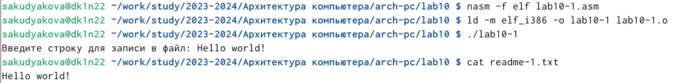

---
## Front matter
title: "Отчёт по лабораторной работе №10"
subtitle: "Дисциплина: Архитектура компьютера"
author: "София Андреевна Кудякова"

## Generic otions
lang: ru-RU
toc-title: "Содержание"

## Bibliography
bibliography: bib/cite.bib
csl: pandoc/csl/gost-r-7-0-5-2008-numeric.csl

## Pdf output format
toc: true # Table of contents
toc-depth: 2
lof: true # List of figures

fontsize: 12pt
linestretch: 1.5
papersize: a4
documentclass: scrreprt
## I18n polyglossia
polyglossia-lang:
  name: russian
  options:
	- spelling=modern
	- babelshorthands=true
polyglossia-otherlangs:
  name: english
## I18n babel
babel-lang: russian
babel-otherlangs: english
## Fonts
mainfont: PT Serif
romanfont: PT Serif
sansfont: PT Sans
monofont: PT Mono
mainfontoptions: Ligatures=TeX
romanfontoptions: Ligatures=TeX
sansfontoptions: Ligatures=TeX,Scale=MatchLowercase
monofontoptions: Scale=MatchLowercase,Scale=0.9
## Biblatex
biblatex: true
biblio-style: "gost-numeric"
biblatexoptions:
  - parentracker=true
  - backend=biber
  - hyperref=auto
  - language=auto
  - autolang=other*
  - citestyle=gost-numeric
## Pandoc-crossref LaTeX customization
figureTitle: "Рис."
tableTitle: "Таблица"
listingTitle: "Листинг"
lofTitle: "Список иллюстраций"

lolTitle: "Листинги"
## Misc options
indent: true
header-includes:
  - \usepackage{indentfirst}
  - \usepackage{float} # keep figures where there are in the text
  - \floatplacement{figure}{H} # keep figures where there are in the text
---

# Цель работы

 Цель данной лабораторной работы - научиться писать программы для работы с файлами.

# Задания

1. Написание программ для работы с файлами
2. Выполнение заданий для самостоятельной работы


# Теоретическое введение

 ОС GNU/Linux является многопользовательской операционной системой. И для обеспечения защиты данных одного пользователя от действий других пользователей существуют специальные механизмы разграничения доступа к файлам. Кроме ограничения доступа, данный механизм позволяет разрешить другим пользователям доступ данным для совместной работы. Права доступа определяют набор действий (чтение, запись, выполнение), разрешённых для выполнения пользователям системы над файлами. Для каждого файла пользователь может входить в одну из трех групп: владелец, член группы владельца, все остальные. Для каждой из этих групп может быть установлен свой набор прав доступа. Владельцем файла является его создатель. Для предоставления прав доступа другому пользователю или другой группе командой
chown [ключи] <новый_пользователь>[:новая_группа] <файл>
или
chgrp [ключи] < новая_группа > <файл>
 Набор прав доступа задается тройками битов и состоит из прав на чтение, запись и ис- полнение файла. В символьном представлении он имеет вид строк rwx, где вместо любого символа может стоять дефис. Всего возможно 8 комбинаций. Буква означает наличие права (установлен в единицу второй бит триады r — чтение, первый бит w — запись, нулевой бит х — исполнение), а дефис означает отсутствие права (нулевое значение соответствующего бита). Также права доступа могут быть представлены как восьмеричное число. Так, права доступа rw- (чтение и запись, без исполнения) понимаются как три двоичные цифры 110 или как восьмеричная цифра 6.
 В операционной системе Linux существуют различные методы управления файлами, например, такие как создание и открытие файла, только для чтения или для чтения и записи, добавления в существующий файл, закрытия и удаления файла, предоставление прав доступа. Обработка файлов в операционной системе Linux осуществляется за счет использования определенных системных вызовов. Для корректной работы и доступа к файлу при его открытии или создании, файлу присваивается уникальный номер (16-битное целое число) – дескриптор файла.
 Для создания и открытия файла служит системный вызов sys_creat, который использует следующие аргументы: права доступа к файлу в регистре ECX, имя файла в EBX и номер системного вызова sys_creat (8) в EAX.
Для открытия существующего файла служит системный вызов sys_open, который использует следующие аргументы: права доступа к файлу в регистре EDX, режим доступа к файлу в регистр ECX, имя файла в EBX и номер системного вызова sys_open (5) в EAX.
Среди режимов доступа к файлам чаще всего используются:
• (0) – O_RDONLY (открыть файл в режиме только для чтения);
• (1) – O_WRONLY – (открыть файл в режиме только записи);
• (2) – O_RDWR – (открыть файл в режиме чтения и записи).
Для записи в файл служит системный вызов sys_write, который использует следующие
аргументы: количество байтов для записи в регистре EDX, строку содержимого для записи
ECX, файловый дескриптор в EBX и номер системного вызова sys_write (4) в EAX.
Системный вызов возвращает фактическое количество записанных байтов в регистр EAX.
В случае ошибки, код ошибки также будет находиться в регистре EAX.
Прежде чем записывать в файл, его необходимо создать или открыть, что позволит полу-
чить дескриптор файла.
Для чтения данных из файла служит системный вызов sys_read, который использует следующие аргументы: количество байтов для чтения в регистре EDX, адрес в памяти для записи прочитанных данных в ECX, файловый дескриптор в EBX и номер системного вызова sys_read (3) в EAX. Как и для записи, прежде чем читать из файла, его необходимо открыть, что позволит получить дескриптор файла.
Для правильного закрытия файла служит системный вызов sys_close, который использует один аргумент – дескриптор файла в регистре EBX. После вызова ядра происходит удаление дескриптора файла, а в случае ошибки, системный вызов возвращает код ошибки в регистр EAX.
Для изменения содержимого файла служит системный вызов sys_lseek, который использует следующие аргументы: исходная позиция для смещения EDX, значение смещения в байтах в ECX, файловый дескриптор в EBX и номер системного вызова sys_lseek (19) в EAX.
Удаление файла осуществляется системным вызовом sys_unlink, который использует
один аргумент – имя файла в регистре EBX.

# Выполнение лабораторной работы
## Написание программ для работы с файлами

 Ввожу команду mkdir, с помощью которой создаю директорию, в которой буду создавать файлы. Перехожу в нее. С помощью команды touch создаю файлы lab09-1.asm, readme-1.txt и readme-2.txt. (рис. @fig:1).

{#fig:1 width=70%}

 Ввожу в файл lab10-1.asm текст программы из листинга 10.1. (рис. @fig:2).
 
{#fig:2 width=70%}

 Создаю исполняемый файл, запускаю его и проверяю его работу. (рис. @fig:3).

{#fig:3 width=70%}

 С помощью команды chmod u-x изменяю права доступа к исполняемому файлу lab10-1,n запретив его выполнение. Попытаюсь выполнить файл. (рис. @fig:4).

{#fig:4 width=70%}

 Программа выдает "Отказано в доступе", так как в команде указано u-x("u" - владелец(я), "-" - удалить разрешение, "x" - разрешение на выполнение)

 С помощью команды chmod u+x изменяю права доступа к файлу lab10-1.asm с исходным текстом программы, добавив права на исполнение. (рис. @fig:5). 

{#fig:5 width=70%}

 Программа срабатывает, так как в команде указано u+x("u" - владелец(я), "+" - добавить разрешение, "x" - разрешение на выполнение)

 В соответствии с вариантом(мой вариант - 14) предоставляю права доступа к файлу readme-1.txt представленные в символьном виде, а для файла readme-2.txt – в двочном виде. Проверяю правильность выполнения с помощью команды ls -l.(рис. @fig:6).
  
{#fig:6 width=70%}

## Выполнение заданий для самостоятельной работы
 Пишу код программы, которая работает по алгоритму:вывод приглашения “Как Вас зовут?”, ввести с клавиатуры свои фамилию и имя, создать файл с именем name.txt, записать в файл сообщение “Меня зовут”, дописать в файл строку введенную с клавиатуры, закрыть файл. (рис. @fig:7).
  
{#fig:7 width=70%}

 Создаю исполняемый файл, запускаю его и проверяю его работу. (рис. @fig:8).
 
{#fig:8 width=70%}

Программа отработала корректно.

**Листинг 4.2.1.**
```NASM
%include 'in_out.asm'
SECTION .data
msg1 db 'Как Вас зовут?', 0h
filename db 'name.txt', 0h
msg2 db 'Меня зовут ', 0h
SECTION .bss
name resb 255
SECTION .text
global _start
_start:

mov eax,msg1
call sprintLF

mov ecx, name
mov edx, 255
call sread

mov ecx, 0777o
mov ebx, filename
mov eax, 8
int 80h

mov ecx, 2
mov ebx, filename
mov eax, 5
int 80h

mov esi, eax

mov eax, msg2
call slen

mov edx, eax
mov ecx, msg2
mov ebx, esi
mov eax, 4
int 80h


mov eax, name
call slen

mov edx, eax
mov ecx, name
mov ebx, esi
mov eax, 4
int 80h

mov ebx, esi
mov eax, 6
int 80h
call quit
```

# Выводы

 В ходе данной лабораторной работы я научилась писать программы для работы с файлами.
 
# Список литературы{.unnumbered}

 [Архитектура ЭВМ](https://esystem.rudn.ru/pluginfile.php/2089097/mod_resource/content/0/%D0%9B%D0%B0%D0%B1%D0%BE%D1%80%D0%B0%D1%82%D0%BE%D1%80%D0%BD%D0%B0%D1%8F%20%D1%80%D0%B0%D0%B1%D0%BE%D1%82%D0%B0%20%E2%84%9610.%20%D0%A0%D0%B0%D0%B1%D0%BE%D1%82%D0%B0%20%D1%81%20%D1%84%D0%B0%D0%B9%D0%BB%D0%B0%D0%BC%D0%B8%20%D1%81%D1%80%D0%B5%D0%B4%D1%81%D1%82%D0%B2%D0%B0%D0%BC%D0%B8%20Nasm.pdf)
